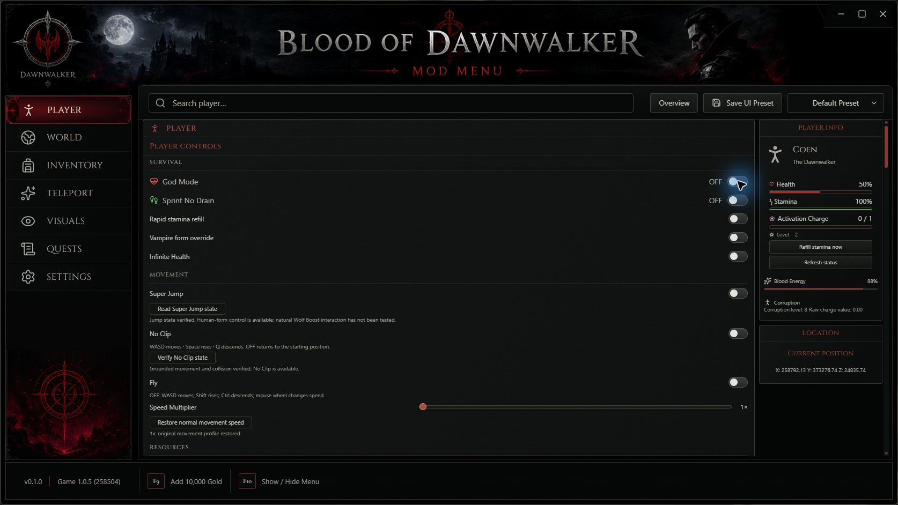
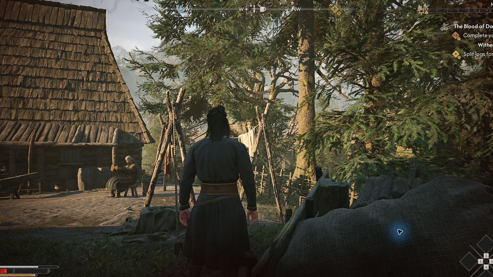

# Blood of Dawnwalker Mod Menu

`cyberfox1337x.function("dawnwalker_mod_menu_readme")`

**An offline, single-player desktop mod menu for _The Blood of Dawnwalker_ (Steam, Windows x64).**

A frameless Electron + React control panel talks to a UE4SS Lua runtime inside the game over a local, session-bound bridge. Every control shows a live readback from the game and refuses an operation it cannot verify, instead of reporting a change that never happened. Nothing in the game's install is patched: no executable edits, no `.pak` files, no anti-cheat or DRM interaction. The installer is transactional — it records backups, verifies the exact game build, and restores the original files on uninstall.

| | |
| --- | --- |
| Version | **0.1.0** |
| Supported game build | Steam build **25232147** — game **1.0.5 / CL258504** |
| Platform | Windows 10/11 x64, Steam release, offline single-player only |
| License | [MIT](LICENSE) — bundled third-party components keep their own notices |



## Features

- **Player** — God Mode, resource locks and refills, vampire-form override, sprint, super jump, personal flight, movement speed, no-clip, Zero Weight (carry capacity), player level, blood segments.
- **Combat** — Super Damage multipliers, cooldown and activation controls, Extended Parry Window.
- **Inventory & progression** — give / set item amounts from the full 1,650-item catalog, unlimited consumables, Ignore Crafting Requirement, currencies, experience multiplier, skills, traits and perks, previewed respec.
- **World** — time of day and story-day clock, game speed, difficulty axes, saved-location teleporting, Timeless Court activities with no time cost.
- **Visuals** — eye colour with glow, natural hair and eyebrow presets, live Skin Colour RGB with exact "Restore Original Skin", plus a local 3D preview of the eye colours.
- **Quests** — automatic quest-journal readback and objective reminders.
- **Save Editor** (game closed) — DwSav-faithful editing of coins, skill points, level, XP, vitals, time of day, inventory rows (add / remove / quantity) and perk ranks, with automatic byte-exact backups and one-click restore.
- **F10** minimises or restores the menu from inside the game. Controls stay disabled at the title screen or when no verified session is loaded.

Every gameplay feature is a UE4SS Lua module under [`integration/imported-menu/Mods/DawnwalkerImportedMenu/Scripts`](integration/imported-menu/Mods/DawnwalkerImportedMenu/Scripts) and was verified live on the pinned build before being enabled in the UI. Anything not proven live is either read-only or hidden.



## Requirements

- Windows x64 with the Steam release of _The Blood of Dawnwalker_ on the supported build above. The installer and the runtime check the executable's size and SHA-256 and refuse any other build.
- Administrator approval for the per-machine installer.
- The compatible UE4SS runtime (official experimental zDEV `v3.0.1-1111-g97b7e501`, MIT) is bundled. Do not run another UE4SS install or a second enabled copy of the menu alongside it.

## Installing the packaged menu

1. Back up your saves, close the game, and close any running copy of the menu.
2. Run `Blood of Dawnwalker Mod Menu-Setup-Current-0.1.0-x64.exe` (from [Releases](../../releases) or the Nexus page) and approve the elevation prompt. Verify the SHA-256 published with the download first — the installer is **not code-signed**.
3. The installer's preflight checks the game build and that the game is closed, then deploys the managed runtime with rollback backups. If preflight refuses, fix what it reports rather than copying files by hand.
4. Open the menu, launch the game through Steam, load a save, and wait for the "connected" state. Press **F10** to switch to the menu.

Uninstall through Windows *Installed apps*. The runtime helper restores its recorded pre-installation state and refuses to finish an incomplete restoration. The tested uninstall restored all 4,081 protected runtime files exactly and preserved all 50 save files.

### What the installer actually does (for reviewers)

The NSIS installer is generated by `electron-builder` from [`installer/current-build.mjs`](installer/current-build.mjs) with the supported assisted UI (`oneClick: false`) and the custom include [`installer/current-installer.nsh`](installer/current-installer.nsh). Its only custom behaviour is three calls to Windows PowerShell 5 with `-NoProfile -NonInteractive -ExecutionPolicy RemoteSigned -File` (never `Bypass` or an encoded command), running the readable scripts [`installer/DawnwalkerImportedRuntimeInstaller.ps1`](installer/DawnwalkerImportedRuntimeInstaller.ps1) and [`installer/DawnwalkerRuntimeInstaller.ps1`](installer/DawnwalkerRuntimeInstaller.ps1):

- **Preflight** (before any change): exact-build identity, game-closed check, ownership conflicts.
- **Install**: hashes every payload file, snapshots the originals, deploys UE4SS + the Lua mod into `Dawnwalker/Binaries/Win64/`, records ownership.
- **Uninstall**: restores the snapshot byte-for-byte; skipped during an in-place upgrade.

[`installer/current-build.Tests.mjs`](installer/current-build.Tests.mjs) pins these properties and [`installer/ExecutionPolicy.Tests.ps1`](installer/ExecutionPolicy.Tests.ps1) proves `RemoteSigned` still rejects an unsigned Internet-zone script. No persistent execution policy or system setting is changed.

## Building from source

Tested with Node.js 24 / npm 11 on Windows 11. Windows PowerShell 5.1 is required for the installer suites; a `lua` interpreter on `PATH` is optional for the standalone Lua harnesses.

```bash
npm install
```

```bash
npm run build
```

```bash
npx electron-builder --win dir --config.directories.output=release-current
```

Then launch `release-current/win-unpacked/Blood of Dawnwalker Mod Menu.exe`. For a live-reload development session use `npm run dev`.

Quality gates:

```bash
npm run lint
```

```bash
npm test
```

```bash
npm run test:lua
```

`npm test` runs the Vitest renderer/main-process suites (600+ tests) plus the Node round-trip checks. `npm run test:lua` runs the UE4SS module suites against the source tree. The full installer pipeline — signature check, lint, tests, runtime payload preparation, installer suites, release gate, build, NSIS packaging and packaged-installer verification — is `npm run package:current`; it fails closed if any step does not pass.

## Repository layout

| Path | What lives there |
| --- | --- |
| `src/` | React renderer: tabs, controls, save editor UI, 3D eye preview (Three.js) |
| `electron/` | Main process and preload: bridge transport, save-file codec, structural save edits, item catalog, asset protocol |
| `integration/imported-menu/` | The UE4SS Lua mod that ships in the installer (`Mods/DawnwalkerImportedMenu`), its manifest and pinned build identity |
| `installer/` | NSIS include, `electron-builder` config, the PowerShell runtime installer, its tests, and the vendored UE4SS zip |
| `scripts/` | Build, signature, packaging-contract and release-gate scripts |
| `analysis/dawnwalker-uue4ss/` | Reverse-engineering write-ups, offline probes and their tests (captured dumps are not committed) |
| `qa/` | The final-release readiness and validation reports referenced below (raw evidence, minidumps and save backups stay local) |
| `docs/` | Design specs, the [full status and verification history](docs/PROJECT-STATUS-HISTORY.md), [third-party notices](docs/THIRD-PARTY-NOTICES.md) |
| `Dawnwalker_RE/` | Notes from studying the game's reflection data (the multi-GB dumps themselves are not committed) |

## Safety and legal scope

- Offline single-player only. The menu never touches multiplayer, anti-cheat, DRM or the signed game executable.
- File-changing operations (installer, save editor) require the game to be closed and take a backup first.
- All reverse engineering was done on the user's own legally owned Steam copy using UE4SS reflection dumps and public metadata. No game assets, code or data tables are redistributed; icons and perk names are read from an export the user generates locally.
- Use only Quicksave2 (or a disposable save) for destructive experiments.

## Known limitations (0.1.0)

- An intermittent startup stall reproduces with UE4SS present at launch — a GameThread/RenderThread deadlock, not caused by this mod's Lua. A relaunch after a stalled boot has always come up. See [`qa/validation-20260918/HANG-ANALYSIS.md`](qa/validation-20260918/HANG-ANALYSIS.md).
- Shrine world effects, repair of permanent blood damage and Photo Camera could not be verified on the prologue save; their request paths exist but are not advertised as proven.
- NPC spawning is deliberately not offered: reading soft object pointers through the pinned UE4SS build crashes the game.
- The installer is unsigned. Its published SHA-256 identifies the tested download.

Full readiness evidence: [`qa/final-product-20260919/FINAL-RELEASE-READINESS.md`](qa/final-product-20260919/FINAL-RELEASE-READINESS.md) and [`qa/final-product-20260919/QUALIFIED-RELEASE-REVIEW.md`](qa/final-product-20260919/QUALIFIED-RELEASE-REVIEW.md).

## Credits

- **cyberfox1337x** — desktop app, installer, Lua integration and project direction.
- **UE4SS** — Narknon and contributors (MIT).
- **ue4ss-ModMenu** framework provenance — Matthew arvidson / mattdavida (MIT).
- **Dawnwalker Form Toggle** contributors — adapted form operations (MIT).
- React, Three.js, Lucide, Cinzel and Cormorant Garamond retain their included notices. See [docs/THIRD-PARTY-NOTICES.md](docs/THIRD-PARTY-NOTICES.md).

_The Blood of Dawnwalker_ and all game content remain the property of their respective owners (Rebel Wolves / Bandai Namco Entertainment). This project is an independent fan tool and is not affiliated with or endorsed by them.
