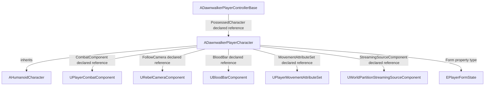

# The Blood of Dawnwalker Reverse Engineering Reference

For implementing existing and additional menu controls, start with the [complete feature-development catalog](Dawnwalker_RE/feature_catalog/README.md): all captured function contracts and type/property metadata, categorized system indexes, exact-symbol feature recipes, asset references, a read-only search CLI, and scoped existing runtime evidence.

Current mod-menu datasets: [build-matched reflection dump](Dawnwalker_RE/full_dump/README.md) and [asset catalog](Dawnwalker_RE/full_dump/assets_extracted/README.md). The September 8 follow-up preserved the existing CL257186 main-menu capture and added searchable current executable strings. The asset catalog includes current property references and captured defaults, separately labeled historical assets, and the actual executable icon. Encrypted texture/model/DataTable payloads remain unextracted. The original game installation, saves, and menu implementation were not modified.

## Document Metadata

Pass captured 2026-09-08T22:38:29.809576+00:00. Scope: local installed build discovery, reusable static reflection indexes, copied-save analysis. Master is persistent and editable. Source generator `dawnwalker_reference_builder` refuses to replace an existing master; future passes merge findings. No game launch, injection, gameplay commands, or original-file edits were performed by this research pass.

## Game Information

CONFIRMED locally: The Blood of Dawnwalker, Steam PC installation, Unreal executable. Product generation and exact version are established below from current executable metadata, independent of older menu README claims.

## Installation and Build Information

CONFIRMED current installation: `c:\program files (x86)\steam\steamapps\common\The Blood of Dawnwalker`. Steam app `3751260`, build `25129649`, state flags `4`. Launcher manifest: `C:\Program Files (x86)\Steam\steamapps\appmanifest_3751260.acf`.

Main executable: `Dawnwalker\Binaries\Win64\Dawnwalker.exe`; **176,196,472 bytes**; file version `dw1-pc-257186-shipping-patch2-all-CL-257186`; product version `dw1-pc-257186-shipping-patch2-all-CL-257186`; SHA-256 `7AD7D09645B0589DC0FF78B53AA1A7B18ECA79B1B7F888B403AB41D88AC7E853`. [Executable/module metadata](Dawnwalker_RE/build_info/executables_modules.json), [launcher discovery](Dawnwalker_RE/build_info/installations.json), [current inventory summary](Dawnwalker_RE/build_info/collection_summary.json).

CONFIRMED engine **Unreal Engine5.5.4**, Shipping: embedded executable version text is corroborated by a historical local crash report with matching build string `5.5.4-257186+dw1-pc-257186-shipping-patch2-all`. See [engine-version evidence](Dawnwalker_RE/build_info/engine_version_evidence.json). A separate earlier runtime artifact reports displayed version1.0.3 from a user-supplied screenshot; this pass did not recapture that screen.

Historical September 2 reflection belongs to the earlier discovery epoch associated with CL-256181 / Steam 25014996. Later pilot documents used CL-256914 / 25107392. Neither proves current offsets or behavior. Capture association is repository provenance, not an executable hash embedded in the dump.

## Research Environment

Windows PowerShell + Python 3.12 standard library. Existing menu project: Electron, React, TypeScript, Vite/Vitest; runtime tooling includes Lua, C++, PowerShell and Python. Research outputs are isolated under `Dawnwalker_RE`. `scripts/index_reflection.py` builds CSV and SQLite from the existing CXX/object capture; `scripts/collect_installation.ps1` reads installed metadata; `scripts/research_saves.py` copies/analyzes saves. The installed process observation found no running Dawnwalker process at collection time; no new live objects were requested.

## Evidence Classification

**CONFIRMED** means directly observed in the named artifact and its recorded scope, not universal gameplay truth. **LIKELY** means converging indirect evidence. **UNKNOWN** means insufficient evidence. **RESEARCHER LABEL** is reserved for explicitly invented descriptive labels. All tables sourced from `captured-dump/2026-09-02-*` are CONFIRMED historical declarations, not confirmed current implementations. A declaration does not prove an executed call, instantiated component, asset row contents or authoritative runtime ownership.

## High Level Architecture

CONFIRMED historical architecture: native project modules `Dawnwalker`, `DogwoodAbilitySystem`, `DogwoodCombat`, `DogwoodStats`, `DogwoodInventory`, `DogwoodCharacterDevelopment`, `DogwoodQuest`, `DogwoodSystem`, `DogwoodUI` coexist with Unreal engine modules. These reflection namespaces are not necessarily separate shipped DLLs. Blueprint subclasses and loaded game objects coexist with native classes. Gameplay Ability System, Enhanced Input and World Partition have project-specific references below; generic engine availability alone is not used as evidence of gameplay usage.

## Executables and Modules

[Current executable/DLL inventory](Dawnwalker_RE/build_info/executables_modules.json) records hashes, version resources and PE observations. The signed shipping game and launcher executable must be distinguished from UE4SS, the native mod bridge and third-party libraries already installed by previous work. Inventory includes existing user modifications; it is not a clean Steam-depot manifest. See [installation findings](Dawnwalker_RE/findings/installation.md).

## Plugins

[Installation inventory](Dawnwalker_RE/inventories/) retains loose plugin/module paths. Reflection module presence proves reflected symbols existed in the historical process; it does not prove all plugin functionality is exercised. Separate UE4SS user mods from Unreal plugins and bundled AMD/NVIDIA/CEF libraries. Exact enabled plugin descriptors may be inside encrypted containers.

## Important Files

[Master indexes](Dawnwalker_RE/README.md), [SQLite knowledge base](Dawnwalker_RE/unreal/knowledge.sqlite), [source hashes](Dawnwalker_RE/unreal/source_hashes.csv), [historical provenance/counts](Dawnwalker_RE/unreal/summary.json), [save research pointer](Dawnwalker_RE/saves/latest.json), [current installed files](Dawnwalker_RE/inventories/). The older `README.md` and `official-build.json` are historical contracts and can lag the current executable.

## Unreal Architecture

CONFIRMED: current installation has IoStore UTOC/UCAS and PAK containers. Reflection supplies UObject classes, struct/property metadata and Blueprint-generated objects. Exact current container flags/counts are in installation findings. The encrypted main directory index prevents this pass from claiming a complete installed asset catalog. Historical loaded-object indexes are a useful partial view.

| Historical declaration | Base / module | Evidence |
|---|---|---|
| `UDawnwalkerAbilitySystemComponent` | `UDogwoodAbilitySystemComponent` / `Dawnwalker` | [source L3232](analysis/dawnwalker-uue4ss/captured-dump/2026-09-02-cxx-sdk/CXXHeaderDump/Dawnwalker.hpp#L3232) |
| `UDogwoodAbilitySystemComponent` | `UAbilitySystemComponent` / `DogwoodAbilitySystem` | [source L40](analysis/dawnwalker-uue4ss/captured-dump/2026-09-02-cxx-sdk/CXXHeaderDump/DogwoodAbilitySystem.hpp#L40) |
| `UDogwoodPlayerInput` | `UEnhancedPlayerInput` / `DogwoodSystem` | [source L369](analysis/dawnwalker-uue4ss/captured-dump/2026-09-02-cxx-sdk/CXXHeaderDump/DogwoodSystem.hpp#L369) |
| `ADawnwalkerPlayerCharacter` | `AHumanoidCharacter` / `Dawnwalker` | [source L1461](analysis/dawnwalker-uue4ss/captured-dump/2026-09-02-cxx-sdk/CXXHeaderDump/Dawnwalker.hpp#L1461) |

CONFIRMED historical declarations (selection; complete CSV/SQLite indexes retain all members):

| Owner | Kind / signature | Evidence |
|---|---|---|
| `UDogwoodAbilitySystemComponent` | property: `FDogwoodAbilitySystemComponentOnBleedingEffectReapplied OnBleedingEffectReapplied` | [L42](analysis/dawnwalker-uue4ss/captured-dump/2026-09-02-cxx-sdk/CXXHeaderDump/DogwoodAbilitySystem.hpp#L42) |
| `UDogwoodAbilitySystemComponent` | function: `void OnBleedingEffectReapplied(const class UAbilitySystemComponent* BleedingTarget)` | [L43](analysis/dawnwalker-uue4ss/captured-dump/2026-09-02-cxx-sdk/CXXHeaderDump/DogwoodAbilitySystem.hpp#L43) |
| `UDogwoodAbilitySystemComponent` | property: `TArray<FRuntimePersistentEffectData> PersistentEffects` | [L44](analysis/dawnwalker-uue4ss/captured-dump/2026-09-02-cxx-sdk/CXXHeaderDump/DogwoodAbilitySystem.hpp#L44) |
| `UDogwoodAbilitySystemComponent` | property: `class UPersistencyComponent* PersistencyComponent` | [L45](analysis/dawnwalker-uue4ss/captured-dump/2026-09-02-cxx-sdk/CXXHeaderDump/DogwoodAbilitySystem.hpp#L45) |
| `ADawnwalkerPlayerCharacter` | property: `class URebelCameraComponent* FollowCamera` | [L1463](analysis/dawnwalker-uue4ss/captured-dump/2026-09-02-cxx-sdk/CXXHeaderDump/Dawnwalker.hpp#L1463) |
| `ADawnwalkerPlayerCharacter` | property: `class UCameraShakeSourceComponent* CameraShakeSource` | [L1464](analysis/dawnwalker-uue4ss/captured-dump/2026-09-02-cxx-sdk/CXXHeaderDump/Dawnwalker.hpp#L1464) |
| `ADawnwalkerPlayerCharacter` | property: `class UPlayerInteractableActivatorComponent* InteractableActivator` | [L1465](analysis/dawnwalker-uue4ss/captured-dump/2026-09-02-cxx-sdk/CXXHeaderDump/Dawnwalker.hpp#L1465) |
| `ADawnwalkerPlayerCharacter` | property: `class UDWPlayerTraversalComponent* TraversalComponent` | [L1466](analysis/dawnwalker-uue4ss/captured-dump/2026-09-02-cxx-sdk/CXXHeaderDump/Dawnwalker.hpp#L1466) |

## Important Classes and Objects

9,304 class declarations and 460,846 object/property/function records indexed. Object record count is not a count of unique gameplay entities. [Classes](Dawnwalker_RE/classes/classes.csv), [game-path object records](Dawnwalker_RE/assets/observed_game_objects.csv).

| Historical declaration | Base / module | Evidence |
|---|---|---|
| `ADawnwalkerPlayerControllerBase` | `APlayerController` / `Dawnwalker` | [source L1624](analysis/dawnwalker-uue4ss/captured-dump/2026-09-02-cxx-sdk/CXXHeaderDump/Dawnwalker.hpp#L1624) |
| `ADawnwalkerPlayerStateBase` | `APlayerState` / `Dawnwalker` | [source L1641](analysis/dawnwalker-uue4ss/captured-dump/2026-09-02-cxx-sdk/CXXHeaderDump/Dawnwalker.hpp#L1641) |
| `ADawnwalkerGameStateBase` | `AGameStateBase` / `Dawnwalker` | [source L1418](analysis/dawnwalker-uue4ss/captured-dump/2026-09-02-cxx-sdk/CXXHeaderDump/Dawnwalker.hpp#L1418) |

CONFIRMED historical declarations (selection; complete CSV/SQLite indexes retain all members):

| Owner | Kind / signature | Evidence |
|---|---|---|
| `ADawnwalkerPlayerControllerBase` | property: `class UEnhancedInputComponent* OnlyMovementInputComponent` | [L1626](analysis/dawnwalker-uue4ss/captured-dump/2026-09-02-cxx-sdk/CXXHeaderDump/Dawnwalker.hpp#L1626) |
| `ADawnwalkerPlayerControllerBase` | property: `class UEnhancedInputComponent* BlankInputComponent` | [L1627](analysis/dawnwalker-uue4ss/captured-dump/2026-09-02-cxx-sdk/CXXHeaderDump/Dawnwalker.hpp#L1627) |
| `ADawnwalkerPlayerControllerBase` | property: `class UGameplayTasksComponent* CachedGameplayTasksComponent` | [L1628](analysis/dawnwalker-uue4ss/captured-dump/2026-09-02-cxx-sdk/CXXHeaderDump/Dawnwalker.hpp#L1628) |
| `ADawnwalkerPlayerControllerBase` | property: `class ADawnwalkerPlayerCharacter* PossessedCharacter` | [L1629](analysis/dawnwalker-uue4ss/captured-dump/2026-09-02-cxx-sdk/CXXHeaderDump/Dawnwalker.hpp#L1629) |
| `ADawnwalkerPlayerStateBase` | property: `class UBloodBarComponent* BloodBar` | [L1643](analysis/dawnwalker-uue4ss/captured-dump/2026-09-02-cxx-sdk/CXXHeaderDump/Dawnwalker.hpp#L1643) |
| `ADawnwalkerGameStateBase` | property: `class UJournal* QuestJournal` | [L1420](analysis/dawnwalker-uue4ss/captured-dump/2026-09-02-cxx-sdk/CXXHeaderDump/Dawnwalker.hpp#L1420) |
| `ADawnwalkerGameStateBase` | property: `FDawnwalkerGameStateBaseOnQuestAddedMulticastDelegate OnQuestAddedMulticastDelegate` | [L1421](analysis/dawnwalker-uue4ss/captured-dump/2026-09-02-cxx-sdk/CXXHeaderDump/Dawnwalker.hpp#L1421) |
| `ADawnwalkerGameStateBase` | function: `void OnQuestAddedMulticastDelegate(const class UQuest* Quest, bool bSilent)` | [L1422](analysis/dawnwalker-uue4ss/captured-dump/2026-09-02-cxx-sdk/CXXHeaderDump/Dawnwalker.hpp#L1422) |
| `ADawnwalkerGameStateBase` | property: `FDawnwalkerGameStateBaseOnQuestUpdatedMulticastDelegate OnQuestUpdatedMulticastDelegate` | [L1423](analysis/dawnwalker-uue4ss/captured-dump/2026-09-02-cxx-sdk/CXXHeaderDump/Dawnwalker.hpp#L1423) |

## Important Components

CONFIRMED historical player fields reference camera, combat, traversal, blood, attribute and streaming components. Actual composition can vary by subclass/runtime state; declared reference is the appropriate relationship strength here.

| Historical declaration | Base / module | Evidence |
|---|---|---|
| `ADawnwalkerPlayerCharacter` | `AHumanoidCharacter` / `Dawnwalker` | [source L1461](analysis/dawnwalker-uue4ss/captured-dump/2026-09-02-cxx-sdk/CXXHeaderDump/Dawnwalker.hpp#L1461) |
| `AHumanoidCharacter` | `ADawnwalkerCharacterBase` / `Dawnwalker` | [source L1863](analysis/dawnwalker-uue4ss/captured-dump/2026-09-02-cxx-sdk/CXXHeaderDump/Dawnwalker.hpp#L1863) |

CONFIRMED historical declarations (selection; complete CSV/SQLite indexes retain all members):

| Owner | Kind / signature | Evidence |
|---|---|---|
| `ADawnwalkerPlayerCharacter` | property: `class URebelCameraComponent* FollowCamera` | [L1463](analysis/dawnwalker-uue4ss/captured-dump/2026-09-02-cxx-sdk/CXXHeaderDump/Dawnwalker.hpp#L1463) |
| `ADawnwalkerPlayerCharacter` | property: `class UCameraShakeSourceComponent* CameraShakeSource` | [L1464](analysis/dawnwalker-uue4ss/captured-dump/2026-09-02-cxx-sdk/CXXHeaderDump/Dawnwalker.hpp#L1464) |
| `ADawnwalkerPlayerCharacter` | property: `class UPlayerInteractableActivatorComponent* InteractableActivator` | [L1465](analysis/dawnwalker-uue4ss/captured-dump/2026-09-02-cxx-sdk/CXXHeaderDump/Dawnwalker.hpp#L1465) |
| `ADawnwalkerPlayerCharacter` | property: `class UDWPlayerTraversalComponent* TraversalComponent` | [L1466](analysis/dawnwalker-uue4ss/captured-dump/2026-09-02-cxx-sdk/CXXHeaderDump/Dawnwalker.hpp#L1466) |
| `ADawnwalkerPlayerCharacter` | property: `class UDWCharacterClawRideComponent* ClawRideComponent` | [L1467](analysis/dawnwalker-uue4ss/captured-dump/2026-09-02-cxx-sdk/CXXHeaderDump/Dawnwalker.hpp#L1467) |
| `ADawnwalkerPlayerCharacter` | property: `class UDWCharacterShadowstepComponent* ShadowstepComponent` | [L1468](analysis/dawnwalker-uue4ss/captured-dump/2026-09-02-cxx-sdk/CXXHeaderDump/Dawnwalker.hpp#L1468) |
| `ADawnwalkerPlayerCharacter` | property: `class UDWCharacterAntiGravComponent* AntiGravComponent` | [L1469](analysis/dawnwalker-uue4ss/captured-dump/2026-09-02-cxx-sdk/CXXHeaderDump/Dawnwalker.hpp#L1469) |
| `ADawnwalkerPlayerCharacter` | property: `class UPlayerCombatComponent* CombatComponent` | [L1470](analysis/dawnwalker-uue4ss/captured-dump/2026-09-02-cxx-sdk/CXXHeaderDump/Dawnwalker.hpp#L1470) |
| `ADawnwalkerPlayerCharacter` | property: `class UCombatFocusComponent* CombatFocusComponent` | [L1471](analysis/dawnwalker-uue4ss/captured-dump/2026-09-02-cxx-sdk/CXXHeaderDump/Dawnwalker.hpp#L1471) |
| `ADawnwalkerPlayerCharacter` | property: `class UFallDamageComponent* FallDamageComponent` | [L1472](analysis/dawnwalker-uue4ss/captured-dump/2026-09-02-cxx-sdk/CXXHeaderDump/Dawnwalker.hpp#L1472) |
| `ADawnwalkerPlayerCharacter` | property: `class UBuffContainerComponent* BuffContainerComponent` | [L1473](analysis/dawnwalker-uue4ss/captured-dump/2026-09-02-cxx-sdk/CXXHeaderDump/Dawnwalker.hpp#L1473) |
| `ADawnwalkerPlayerCharacter` | property: `class UStaticMeshComponent* SheathedWeaponMesh` | [L1474](analysis/dawnwalker-uue4ss/captured-dump/2026-09-02-cxx-sdk/CXXHeaderDump/Dawnwalker.hpp#L1474) |
| `AHumanoidCharacter` | property: `class UAppearanceBase* LoadedAppearanceData` | [L1865](analysis/dawnwalker-uue4ss/captured-dump/2026-09-02-cxx-sdk/CXXHeaderDump/Dawnwalker.hpp#L1865) |
| `AHumanoidCharacter` | property: `class UCharacterLadderUserComponent* LadderComponent` | [L1866](analysis/dawnwalker-uue4ss/captured-dump/2026-09-02-cxx-sdk/CXXHeaderDump/Dawnwalker.hpp#L1866) |
| `AHumanoidCharacter` | property: `class UAppearanceComponent* AppearanceComponent` | [L1867](analysis/dawnwalker-uue4ss/captured-dump/2026-09-02-cxx-sdk/CXXHeaderDump/Dawnwalker.hpp#L1867) |
| `AHumanoidCharacter` | property: `class USkeletalMeshComponent* LeaderMesh` | [L1868](analysis/dawnwalker-uue4ss/captured-dump/2026-09-02-cxx-sdk/CXXHeaderDump/Dawnwalker.hpp#L1868) |
| `AHumanoidCharacter` | property: `class USkeletalMeshComponent* HairMesh` | [L1869](analysis/dawnwalker-uue4ss/captured-dump/2026-09-02-cxx-sdk/CXXHeaderDump/Dawnwalker.hpp#L1869) |
| `AHumanoidCharacter` | property: `class USkeletalMeshComponent* EyebrowMeshComponent` | [L1870](analysis/dawnwalker-uue4ss/captured-dump/2026-09-02-cxx-sdk/CXXHeaderDump/Dawnwalker.hpp#L1870) |
| `AHumanoidCharacter` | property: `class USkeletalMeshComponent* BeardMeshComponent` | [L1871](analysis/dawnwalker-uue4ss/captured-dump/2026-09-02-cxx-sdk/CXXHeaderDump/Dawnwalker.hpp#L1871) |
| `AHumanoidCharacter` | property: `class USkeletalMeshComponent* HeadMesh` | [L1872](analysis/dawnwalker-uue4ss/captured-dump/2026-09-02-cxx-sdk/CXXHeaderDump/Dawnwalker.hpp#L1872) |
| `AHumanoidCharacter` | property: `class USkeletalMeshComponent* TorsoMesh` | [L1873](analysis/dawnwalker-uue4ss/captured-dump/2026-09-02-cxx-sdk/CXXHeaderDump/Dawnwalker.hpp#L1873) |
| `AHumanoidCharacter` | property: `class USkeletalMeshComponent* HandMesh` | [L1874](analysis/dawnwalker-uue4ss/captured-dump/2026-09-02-cxx-sdk/CXXHeaderDump/Dawnwalker.hpp#L1874) |
| `AHumanoidCharacter` | property: `class USkeletalMeshComponent* LegMesh` | [L1875](analysis/dawnwalker-uue4ss/captured-dump/2026-09-02-cxx-sdk/CXXHeaderDump/Dawnwalker.hpp#L1875) |
| `AHumanoidCharacter` | property: `class USkeletalMeshComponent* FeetMesh` | [L1876](analysis/dawnwalker-uue4ss/captured-dump/2026-09-02-cxx-sdk/CXXHeaderDump/Dawnwalker.hpp#L1876) |

## Important Subsystems and Managers

Subsystem inheritance distinguishes world lifetime from game-instance lifetime; it does not by itself identify ownership of every saved value.

| Historical declaration | Base / module | Evidence |
|---|---|---|
| `UTimeSystemImpl` | `UTimeSystemInterface` / `DogwoodSystem` | [source L510](analysis/dawnwalker-uue4ss/captured-dump/2026-09-02-cxx-sdk/CXXHeaderDump/DogwoodSystem.hpp#L510) |
| `UInventorySubsystem` | `UGameInstanceSubsystem` / `DogwoodInventory` | [source L817](analysis/dawnwalker-uue4ss/captured-dump/2026-09-02-cxx-sdk/CXXHeaderDump/DogwoodInventory.hpp#L817) |
| `UCombatSubsystem` | `UTickableWorldSubsystem` / `DogwoodCombat` | [source L1597](analysis/dawnwalker-uue4ss/captured-dump/2026-09-02-cxx-sdk/CXXHeaderDump/DogwoodCombat.hpp#L1597) |
| `UCharacterDevelopmentSubsystem` | `UGameInstanceSubsystem` / `DogwoodCharacterDevelopment` | [source L152](analysis/dawnwalker-uue4ss/captured-dump/2026-09-02-cxx-sdk/CXXHeaderDump/DogwoodCharacterDevelopment.hpp#L152) |

CONFIRMED historical declarations (selection; complete CSV/SQLite indexes retain all members):

| Owner | Kind / signature | Evidence |
|---|---|---|
| `UTimeSystemImpl` | property: `FTimeSystemImplOnDayTimeChangedDynamicDelegate OnDayTimeChangedDynamicDelegate` | [L512](analysis/dawnwalker-uue4ss/captured-dump/2026-09-02-cxx-sdk/CXXHeaderDump/DogwoodSystem.hpp#L512) |
| `UTimeSystemImpl` | function: `void OnDayTimeChangedDynamic(const FDayTime& PrevGameTime, const FDayTime& CurrentGameTime)` | [L513](analysis/dawnwalker-uue4ss/captured-dump/2026-09-02-cxx-sdk/CXXHeaderDump/DogwoodSystem.hpp#L513) |
| `UTimeSystemImpl` | property: `FTimeSystemImplOnInterpolatedDayTimeChangedDynamicDelegate OnInterpolatedDayTimeChangedDynamicDelegate` | [L514](analysis/dawnwalker-uue4ss/captured-dump/2026-09-02-cxx-sdk/CXXHeaderDump/DogwoodSystem.hpp#L514) |
| `UTimeSystemImpl` | function: `void OnDayTimeChangedDynamic(const FDayTime& PrevGameTime, const FDayTime& CurrentGameTime)` | [L515](analysis/dawnwalker-uue4ss/captured-dump/2026-09-02-cxx-sdk/CXXHeaderDump/DogwoodSystem.hpp#L515) |
| `UInventorySubsystem` | property: `TMap<FName, UItemBaseDataAsset*> LoadedItemMap` | [L819](analysis/dawnwalker-uue4ss/captured-dump/2026-09-02-cxx-sdk/CXXHeaderDump/DogwoodInventory.hpp#L819) |
| `UInventorySubsystem` | property: `TMap<ESpecialInventoryType, UInventoryComponent*> SpecialInventoryMap` | [L820](analysis/dawnwalker-uue4ss/captured-dump/2026-09-02-cxx-sdk/CXXHeaderDump/DogwoodInventory.hpp#L820) |
| `UInventorySubsystem` | property: `TSubclassOf<class UAnimInstance> LoadedRenderDollAnimInstance` | [L821](analysis/dawnwalker-uue4ss/captured-dump/2026-09-02-cxx-sdk/CXXHeaderDump/DogwoodInventory.hpp#L821) |
| `UInventorySubsystem` | property: `class UItemScalingCostDataAsset* LoadedItemScalingCostData` | [L822](analysis/dawnwalker-uue4ss/captured-dump/2026-09-02-cxx-sdk/CXXHeaderDump/DogwoodInventory.hpp#L822) |
| `UCombatSubsystem` | property: `FCombatSubsystemOnBossfightStarted OnBossfightStarted` | [L1599](analysis/dawnwalker-uue4ss/captured-dump/2026-09-02-cxx-sdk/CXXHeaderDump/DogwoodCombat.hpp#L1599) |
| `UCombatSubsystem` | function: `void BossfightStartedDelegate(class UNPCCombatComponent* BossEnemy)` | [L1600](analysis/dawnwalker-uue4ss/captured-dump/2026-09-02-cxx-sdk/CXXHeaderDump/DogwoodCombat.hpp#L1600) |
| `UCombatSubsystem` | property: `FCombatSubsystemOnCombatStarted OnCombatStarted` | [L1601](analysis/dawnwalker-uue4ss/captured-dump/2026-09-02-cxx-sdk/CXXHeaderDump/DogwoodCombat.hpp#L1601) |
| `UCombatSubsystem` | function: `void CombatStartedDelegate()` | [L1602](analysis/dawnwalker-uue4ss/captured-dump/2026-09-02-cxx-sdk/CXXHeaderDump/DogwoodCombat.hpp#L1602) |
| `UCharacterDevelopmentSubsystem` | property: `class USkillBookPoolDataAsset* SkillBookPool` | [L154](analysis/dawnwalker-uue4ss/captured-dump/2026-09-02-cxx-sdk/CXXHeaderDump/DogwoodCharacterDevelopment.hpp#L154) |
| `UCharacterDevelopmentSubsystem` | property: `class UCurveFloat* SkillsToLevelCurve` | [L155](analysis/dawnwalker-uue4ss/captured-dump/2026-09-02-cxx-sdk/CXXHeaderDump/DogwoodCharacterDevelopment.hpp#L155) |
| `UCharacterDevelopmentSubsystem` | property: `FCharacterDevelopmentSubsystemOnLevelUp OnLevelUp` | [L156](analysis/dawnwalker-uue4ss/captured-dump/2026-09-02-cxx-sdk/CXXHeaderDump/DogwoodCharacterDevelopment.hpp#L156) |
| `UCharacterDevelopmentSubsystem` | function: `void OnLevelUp(int32 TraitPointsGained)` | [L157](analysis/dawnwalker-uue4ss/captured-dump/2026-09-02-cxx-sdk/CXXHeaderDump/DogwoodCharacterDevelopment.hpp#L157) |

## Important Functions

21,743 reflected function declarations indexed in [functions.csv](Dawnwalker_RE/functions/functions.csv). Blueprint display-style names containing spaces are preserved exactly; these are SDK reconstructed declarations, not necessarily valid C++ identifiers or verified invocation ABI. Earlier raw-Lua-string calls to FName parameters crashed; inspect matching-build marshaling evidence before use.

## Important Variables and Properties

54,463 declared properties indexed in [properties.csv](Dawnwalker_RE/classes/properties.csv). Stable indexes omit offsets; source lines can contain historical offsets and must never be reused against an unverified build.

## Important Structs

7,264 declarations in [structs.csv](Dawnwalker_RE/classes/structs.csv).

| Historical declaration | Base / module | Evidence |
|---|---|---|
| `FDayTime` | `` / `DogwoodSystem` | [source L50](analysis/dawnwalker-uue4ss/captured-dump/2026-09-02-cxx-sdk/CXXHeaderDump/DogwoodSystem.hpp#L50) |
| `FSegmentedDayTime` | `` / `DogwoodSystem` | [source L129](analysis/dawnwalker-uue4ss/captured-dump/2026-09-02-cxx-sdk/CXXHeaderDump/DogwoodSystem.hpp#L129) |
| `FItemHandle` | `` / `DogwoodInventory` | [source L127](analysis/dawnwalker-uue4ss/captured-dump/2026-09-02-cxx-sdk/CXXHeaderDump/DogwoodInventory.hpp#L127) |
| `FObjective` | `` / `Quest` | [source L29](analysis/dawnwalker-uue4ss/captured-dump/2026-09-02-cxx-sdk/CXXHeaderDump/Quest.hpp#L29) |

CONFIRMED historical declarations (selection; complete CSV/SQLite indexes retain all members):

| Owner | Kind / signature | Evidence |
|---|---|---|
| `FDayTime` | property: `uint8 Hour` | [L52](analysis/dawnwalker-uue4ss/captured-dump/2026-09-02-cxx-sdk/CXXHeaderDump/DogwoodSystem.hpp#L52) |
| `FDayTime` | property: `uint8 Minute` | [L53](analysis/dawnwalker-uue4ss/captured-dump/2026-09-02-cxx-sdk/CXXHeaderDump/DogwoodSystem.hpp#L53) |
| `FDayTime` | property: `uint8 Second` | [L54](analysis/dawnwalker-uue4ss/captured-dump/2026-09-02-cxx-sdk/CXXHeaderDump/DogwoodSystem.hpp#L54) |
| `FSegmentedDayTime` | property: `float Value` | [L131](analysis/dawnwalker-uue4ss/captured-dump/2026-09-02-cxx-sdk/CXXHeaderDump/DogwoodSystem.hpp#L131) |
| `FSegmentedDayTime` | property: `bool bIsDay` | [L132](analysis/dawnwalker-uue4ss/captured-dump/2026-09-02-cxx-sdk/CXXHeaderDump/DogwoodSystem.hpp#L132) |
| `FObjective` | property: `FText Text` | [L31](analysis/dawnwalker-uue4ss/captured-dump/2026-09-02-cxx-sdk/CXXHeaderDump/Quest.hpp#L31) |
| `FObjective` | property: `FGuid ID` | [L32](analysis/dawnwalker-uue4ss/captured-dump/2026-09-02-cxx-sdk/CXXHeaderDump/Quest.hpp#L32) |
| `FObjective` | property: `FText ActiveObjectiveDescription` | [L33](analysis/dawnwalker-uue4ss/captured-dump/2026-09-02-cxx-sdk/CXXHeaderDump/Quest.hpp#L33) |
| `FObjective` | property: `bool bPushTimeToSpecificHour` | [L34](analysis/dawnwalker-uue4ss/captured-dump/2026-09-02-cxx-sdk/CXXHeaderDump/Quest.hpp#L34) |

## Important Enums

2,483 enums / 15,477 values indexed. [Enums](Dawnwalker_RE/classes/enums.csv), [values](Dawnwalker_RE/classes/enum_values.csv).

| Historical declaration | Base / module | Evidence |
|---|---|---|
| `EPlayerFormState` | `` / `Dawnwalker` | [source L550](analysis/dawnwalker-uue4ss/captured-dump/2026-09-02-cxx-sdk/CXXHeaderDump/Dawnwalker_enums.hpp#L550) |
| `EPlayerFormSelectionPolicy` | `` / `Dawnwalker` | [source L543](analysis/dawnwalker-uue4ss/captured-dump/2026-09-02-cxx-sdk/CXXHeaderDump/Dawnwalker_enums.hpp#L543) |
| `ECurrencyType` | `` / `DogwoodInventory` | [source L107](analysis/dawnwalker-uue4ss/captured-dump/2026-09-02-cxx-sdk/CXXHeaderDump/DogwoodInventory_enums.hpp#L107) |

CONFIRMED historical declarations (selection; complete CSV/SQLite indexes retain all members):

| Owner | Kind / signature | Evidence |
|---|---|---|
| `EPlayerFormState` | enum_value: `Human = 0` | [L551](analysis/dawnwalker-uue4ss/captured-dump/2026-09-02-cxx-sdk/CXXHeaderDump/Dawnwalker_enums.hpp#L551) |
| `EPlayerFormState` | enum_value: `Vampire = 1` | [L552](analysis/dawnwalker-uue4ss/captured-dump/2026-09-02-cxx-sdk/CXXHeaderDump/Dawnwalker_enums.hpp#L552) |
| `EPlayerFormState` | enum_value: `EPlayerFormState_MAX = 2` | [L553](analysis/dawnwalker-uue4ss/captured-dump/2026-09-02-cxx-sdk/CXXHeaderDump/Dawnwalker_enums.hpp#L553) |
| `EPlayerFormSelectionPolicy` | enum_value: `BasedOnTimeOfDay = 0` | [L544](analysis/dawnwalker-uue4ss/captured-dump/2026-09-02-cxx-sdk/CXXHeaderDump/Dawnwalker_enums.hpp#L544) |
| `EPlayerFormSelectionPolicy` | enum_value: `ForceHuman = 1` | [L545](analysis/dawnwalker-uue4ss/captured-dump/2026-09-02-cxx-sdk/CXXHeaderDump/Dawnwalker_enums.hpp#L545) |
| `EPlayerFormSelectionPolicy` | enum_value: `ForceVampire = 2` | [L546](analysis/dawnwalker-uue4ss/captured-dump/2026-09-02-cxx-sdk/CXXHeaderDump/Dawnwalker_enums.hpp#L546) |
| `EPlayerFormSelectionPolicy` | enum_value: `EPlayerFormSelectionPolicy_MAX = 3` | [L547](analysis/dawnwalker-uue4ss/captured-dump/2026-09-02-cxx-sdk/CXXHeaderDump/Dawnwalker_enums.hpp#L547) |
| `ECurrencyType` | enum_value: `Coin = 0` | [L108](analysis/dawnwalker-uue4ss/captured-dump/2026-09-02-cxx-sdk/CXXHeaderDump/DogwoodInventory_enums.hpp#L108) |
| `ECurrencyType` | enum_value: `ECurrencyType_MAX = 1` | [L109](analysis/dawnwalker-uue4ss/captured-dump/2026-09-02-cxx-sdk/CXXHeaderDump/DogwoodInventory_enums.hpp#L109) |

## Data Tables

[DataTable-related objects](Dawnwalker_RE/data_tables/data_tables.csv) is a candidate index including type references/defaults. This pass has not decoded all table rows, balanced values or item display names. Never equate number of related objects to number of distinct tables.

## Data Assets

[DataAsset candidates](Dawnwalker_RE/assets/data_assets.csv) retain source lines and reflected class paths. Definitions, loaded instances and generated defaults are separate concepts. Value reconstruction requires row/object content, not only a path.

## Gameplay Tags

Project GAS fields confirm tag use, but [tag-related object names](Dawnwalker_RE/gameplay_tags/tag_related_objects.csv) is not a complete GameplayTag value dictionary. UNKNOWN: exact complete registered tag catalog.

CONFIRMED separately in an existing read-only probe on build25129649/CL257186, session1788898334-344745-1: `GE_WolfBoost_SpedBoost_Lvl3` and `GE_WolfBoost_SpedBoost_Lvl4` declare asset tag `ActiveFocusAbility.WolfBoost`, granted tag `Effect.WolfBoost.Enhanced`, and ongoing required tags `Player.IsVampire` and `Character.State.AllowVampireActiveAbilities`. Exact spelling `SpedBoost` is retained. Four effects/eight tag relationships/four distinct tag values are indexed with source SHA-256 in [verified_effect_tags.json](Dawnwalker_RE/gameplay_tags/verified_effect_tags.json). These are effect definitions observed earlier, not proof effects are active now.

The same probe observes `GE_WolfBoost_JumpIncrease` modifier `JumpVelocity`, owner `/Script/DogwoodStats.PlayerMovementAttributeSet`, raw magnitude1.5. `GE_FallDamage` has two `Damage` modifiers owned by `/Script/DogwoodStats.CharacterBaseAttributeSet`, custom calculation kind2. Their raw zero scalar does not establish zero final damage. This provides concrete effect-to-attribute relationships without inventing execution order or enum meanings.

## Blueprint Architecture

Historical `.hpp` files include generated gameplay/animation Blueprint classes; source header module labels for those files are dump groups, not proven native modules. Object paths beginning `/Game/` retain package/object identities in the SQLite objects table. The loaded capture excludes unloaded content.

## Native Class Architecture

`UDawnwalkerAbilitySystemComponent -> UDogwoodAbilitySystemComponent -> UAbilitySystemComponent` and `ADawnwalkerPlayerCharacter -> AHumanoidCharacter` are direct historical declaration edges. [Typed relationships](Dawnwalker_RE/relationships/declarations.csv) distinguish inheritance, declares_property and declared_type_reference.

## System Map

Historical declared references: player -> CombatComponent/UPlayerCombatComponent; player -> BloodBar/UBloodBarComponent; player -> MovementAttributeSet/UPlayerMovementAttributeSet; player -> StreamingSourceComponent/UWorldPartitionStreamingSourceComponent; player controller -> PossessedCharacter/ADawnwalkerPlayerCharacter. These edges are confirmed schema relationships. An executed attack-to-damage call chain remains UNKNOWN.

Source: historical `Dawnwalker.hpp` L1461–1487 and L1624–1629; source-linked tables immediately below retain individual lines. Diagram arrows are schema references/inheritance, not claims about an active current object graph.

## Coen Player Architecture

The internal player class is `ADawnwalkerPlayerCharacter`; Coen is the user-facing character name, not substituted into invented symbols. Controller holds `PossessedCharacter`. The character declares dedicated claw-ride, shadowstep and anti-gravity traversal components alongside combat, camera and attributes. Native class layout evidence does not establish every component's active state.

| Historical declaration | Base / module | Evidence |
|---|---|---|
| `ADawnwalkerPlayerControllerBase` | `APlayerController` / `Dawnwalker` | [source L1624](analysis/dawnwalker-uue4ss/captured-dump/2026-09-02-cxx-sdk/CXXHeaderDump/Dawnwalker.hpp#L1624) |
| `ADawnwalkerPlayerCharacter` | `AHumanoidCharacter` / `Dawnwalker` | [source L1461](analysis/dawnwalker-uue4ss/captured-dump/2026-09-02-cxx-sdk/CXXHeaderDump/Dawnwalker.hpp#L1461) |

CONFIRMED historical declarations (selection; complete CSV/SQLite indexes retain all members):

| Owner | Kind / signature | Evidence |
|---|---|---|
| `ADawnwalkerPlayerControllerBase` | property: `class UEnhancedInputComponent* OnlyMovementInputComponent` | [L1626](analysis/dawnwalker-uue4ss/captured-dump/2026-09-02-cxx-sdk/CXXHeaderDump/Dawnwalker.hpp#L1626) |
| `ADawnwalkerPlayerControllerBase` | property: `class UEnhancedInputComponent* BlankInputComponent` | [L1627](analysis/dawnwalker-uue4ss/captured-dump/2026-09-02-cxx-sdk/CXXHeaderDump/Dawnwalker.hpp#L1627) |
| `ADawnwalkerPlayerControllerBase` | property: `class UGameplayTasksComponent* CachedGameplayTasksComponent` | [L1628](analysis/dawnwalker-uue4ss/captured-dump/2026-09-02-cxx-sdk/CXXHeaderDump/Dawnwalker.hpp#L1628) |
| `ADawnwalkerPlayerControllerBase` | property: `class ADawnwalkerPlayerCharacter* PossessedCharacter` | [L1629](analysis/dawnwalker-uue4ss/captured-dump/2026-09-02-cxx-sdk/CXXHeaderDump/Dawnwalker.hpp#L1629) |
| `ADawnwalkerPlayerControllerBase` | property: `int32 GameInputBlockers` | [L1630](analysis/dawnwalker-uue4ss/captured-dump/2026-09-02-cxx-sdk/CXXHeaderDump/Dawnwalker.hpp#L1630) |
| `ADawnwalkerPlayerControllerBase` | property: `float BaseTurnRate` | [L1631](analysis/dawnwalker-uue4ss/captured-dump/2026-09-02-cxx-sdk/CXXHeaderDump/Dawnwalker.hpp#L1631) |
| `ADawnwalkerPlayerControllerBase` | property: `float BaseLookUpRate` | [L1632](analysis/dawnwalker-uue4ss/captured-dump/2026-09-02-cxx-sdk/CXXHeaderDump/Dawnwalker.hpp#L1632) |
| `ADawnwalkerPlayerControllerBase` | property: `class UPlayerInputConfig* PlayerInputConfig` | [L1633](analysis/dawnwalker-uue4ss/captured-dump/2026-09-02-cxx-sdk/CXXHeaderDump/Dawnwalker.hpp#L1633) |
| `ADawnwalkerPlayerControllerBase` | function: `void SetGameInputBlockerActive(EGameInputBlocker Blocker, bool bActive)` | [L1635](analysis/dawnwalker-uue4ss/captured-dump/2026-09-02-cxx-sdk/CXXHeaderDump/Dawnwalker.hpp#L1635) |
| `ADawnwalkerPlayerControllerBase` | function: `void RemovePawnInputBlocker(FName Blocker)` | [L1636](analysis/dawnwalker-uue4ss/captured-dump/2026-09-02-cxx-sdk/CXXHeaderDump/Dawnwalker.hpp#L1636) |
| `ADawnwalkerPlayerControllerBase` | function: `bool IsAnyGameInputBlockerActive()` | [L1637](analysis/dawnwalker-uue4ss/captured-dump/2026-09-02-cxx-sdk/CXXHeaderDump/Dawnwalker.hpp#L1637) |
| `ADawnwalkerPlayerControllerBase` | function: `void AddPawnInputBlocker(FName Blocker)` | [L1638](analysis/dawnwalker-uue4ss/captured-dump/2026-09-02-cxx-sdk/CXXHeaderDump/Dawnwalker.hpp#L1638) |
| `ADawnwalkerPlayerCharacter` | property: `class URebelCameraComponent* FollowCamera` | [L1463](analysis/dawnwalker-uue4ss/captured-dump/2026-09-02-cxx-sdk/CXXHeaderDump/Dawnwalker.hpp#L1463) |
| `ADawnwalkerPlayerCharacter` | property: `class UCameraShakeSourceComponent* CameraShakeSource` | [L1464](analysis/dawnwalker-uue4ss/captured-dump/2026-09-02-cxx-sdk/CXXHeaderDump/Dawnwalker.hpp#L1464) |
| `ADawnwalkerPlayerCharacter` | property: `class UPlayerInteractableActivatorComponent* InteractableActivator` | [L1465](analysis/dawnwalker-uue4ss/captured-dump/2026-09-02-cxx-sdk/CXXHeaderDump/Dawnwalker.hpp#L1465) |
| `ADawnwalkerPlayerCharacter` | property: `class UDWPlayerTraversalComponent* TraversalComponent` | [L1466](analysis/dawnwalker-uue4ss/captured-dump/2026-09-02-cxx-sdk/CXXHeaderDump/Dawnwalker.hpp#L1466) |
| `ADawnwalkerPlayerCharacter` | property: `class UDWCharacterClawRideComponent* ClawRideComponent` | [L1467](analysis/dawnwalker-uue4ss/captured-dump/2026-09-02-cxx-sdk/CXXHeaderDump/Dawnwalker.hpp#L1467) |
| `ADawnwalkerPlayerCharacter` | property: `class UDWCharacterShadowstepComponent* ShadowstepComponent` | [L1468](analysis/dawnwalker-uue4ss/captured-dump/2026-09-02-cxx-sdk/CXXHeaderDump/Dawnwalker.hpp#L1468) |
| `ADawnwalkerPlayerCharacter` | property: `class UDWCharacterAntiGravComponent* AntiGravComponent` | [L1469](analysis/dawnwalker-uue4ss/captured-dump/2026-09-02-cxx-sdk/CXXHeaderDump/Dawnwalker.hpp#L1469) |
| `ADawnwalkerPlayerCharacter` | property: `class UPlayerCombatComponent* CombatComponent` | [L1470](analysis/dawnwalker-uue4ss/captured-dump/2026-09-02-cxx-sdk/CXXHeaderDump/Dawnwalker.hpp#L1470) |
| `ADawnwalkerPlayerCharacter` | property: `class UCombatFocusComponent* CombatFocusComponent` | [L1471](analysis/dawnwalker-uue4ss/captured-dump/2026-09-02-cxx-sdk/CXXHeaderDump/Dawnwalker.hpp#L1471) |
| `ADawnwalkerPlayerCharacter` | property: `class UFallDamageComponent* FallDamageComponent` | [L1472](analysis/dawnwalker-uue4ss/captured-dump/2026-09-02-cxx-sdk/CXXHeaderDump/Dawnwalker.hpp#L1472) |
| `ADawnwalkerPlayerCharacter` | property: `class UBuffContainerComponent* BuffContainerComponent` | [L1473](analysis/dawnwalker-uue4ss/captured-dump/2026-09-02-cxx-sdk/CXXHeaderDump/Dawnwalker.hpp#L1473) |
| `ADawnwalkerPlayerCharacter` | property: `class UStaticMeshComponent* SheathedWeaponMesh` | [L1474](analysis/dawnwalker-uue4ss/captured-dump/2026-09-02-cxx-sdk/CXXHeaderDump/Dawnwalker.hpp#L1474) |
| `ADawnwalkerPlayerCharacter` | property: `class UStaticMeshComponent* ScabbardMesh` | [L1475](analysis/dawnwalker-uue4ss/captured-dump/2026-09-02-cxx-sdk/CXXHeaderDump/Dawnwalker.hpp#L1475) |

## Human and Vampire Forms

CONFIRMED historical: `ADawnwalkerPlayerCharacter.Form` uses `EPlayerFormState` (Human=0, Vampire=1). `FormSelectionPolicy` uses BasedOnTimeOfDay=0, ForceHuman=1, ForceVampire=2. `SetFormSelectionPolicy` and `OnFormChanged` are declared. `UQuestNodeChangePlayerFormSelectionPolicy.NewPolicy` establishes a quest-configurable policy route. LIKELY: time/quest policy gates form selection. UNKNOWN: complete native transition ordering, save representation, all visual/attribute restrictions. Source: Dawnwalker.hpp L1486, L1562, L5196; Dawnwalker_enums.hpp L543.

| Historical declaration | Base / module | Evidence |
|---|---|---|
| `UQuestNodeChangePlayerFormSelectionPolicy` | `UQuestNode` / `Dawnwalker` | [source L5196](analysis/dawnwalker-uue4ss/captured-dump/2026-09-02-cxx-sdk/CXXHeaderDump/Dawnwalker.hpp#L5196) |
| `UVampireAttributeSet` | `UAttributeSet` / `DogwoodStats` | [source L958](analysis/dawnwalker-uue4ss/captured-dump/2026-09-02-cxx-sdk/CXXHeaderDump/DogwoodStats.hpp#L958) |

CONFIRMED historical declarations (selection; complete CSV/SQLite indexes retain all members):

| Owner | Kind / signature | Evidence |
|---|---|---|
| `UQuestNodeChangePlayerFormSelectionPolicy` | property: `EPlayerFormSelectionPolicy NewPolicy` | [L5198](analysis/dawnwalker-uue4ss/captured-dump/2026-09-02-cxx-sdk/CXXHeaderDump/Dawnwalker.hpp#L5198) |
| `UVampireAttributeSet` | property: `FGameplayAttributeData Blood` | [L960](analysis/dawnwalker-uue4ss/captured-dump/2026-09-02-cxx-sdk/CXXHeaderDump/DogwoodStats.hpp#L960) |
| `UVampireAttributeSet` | property: `FGameplayAttributeData BloodPermDamage` | [L961](analysis/dawnwalker-uue4ss/captured-dump/2026-09-02-cxx-sdk/CXXHeaderDump/DogwoodStats.hpp#L961) |
| `UVampireAttributeSet` | property: `FGameplayAttributeData ReplenishPercentage` | [L962](analysis/dawnwalker-uue4ss/captured-dump/2026-09-02-cxx-sdk/CXXHeaderDump/DogwoodStats.hpp#L962) |
| `UVampireAttributeSet` | property: `FGameplayAttributeData ReplenishAmount` | [L963](analysis/dawnwalker-uue4ss/captured-dump/2026-09-02-cxx-sdk/CXXHeaderDump/DogwoodStats.hpp#L963) |
| `UVampireAttributeSet` | property: `FGameplayAttributeData SegmentCountOverride` | [L964](analysis/dawnwalker-uue4ss/captured-dump/2026-09-02-cxx-sdk/CXXHeaderDump/DogwoodStats.hpp#L964) |
| `UVampireAttributeSet` | property: `FGameplayAttributeData BloodSegmentsAtNightStart` | [L965](analysis/dawnwalker-uue4ss/captured-dump/2026-09-02-cxx-sdk/CXXHeaderDump/DogwoodStats.hpp#L965) |

## Day and Night System

CONFIRMED historical `UTimeSystemImpl` exposes `GetCurrentDay`, `GetCurrentDayTime`, `GetCurrentDayTimeAsFloat`, `AddTimeSegments`, `SetTime`, quest-time-to-segment conversion, phase-transition queries and both interpolated/day/phase delegates. LIKELY hybrid architecture: segmented gameplay progression plus continuous/interpolated presentation and quest-driven increments. Exact progression rates, trigger execution order and NPC listeners are UNKNOWN; no current time value is claimed with the game closed.

| Historical declaration | Base / module | Evidence |
|---|---|---|
| `UTimeSystemImpl` | `UTimeSystemInterface` / `DogwoodSystem` | [source L510](analysis/dawnwalker-uue4ss/captured-dump/2026-09-02-cxx-sdk/CXXHeaderDump/DogwoodSystem.hpp#L510) |
| `FDayTime` | `` / `DogwoodSystem` | [source L50](analysis/dawnwalker-uue4ss/captured-dump/2026-09-02-cxx-sdk/CXXHeaderDump/DogwoodSystem.hpp#L50) |
| `FSegmentedDayTime` | `` / `DogwoodSystem` | [source L129](analysis/dawnwalker-uue4ss/captured-dump/2026-09-02-cxx-sdk/CXXHeaderDump/DogwoodSystem.hpp#L129) |

CONFIRMED historical declarations (selection; complete CSV/SQLite indexes retain all members):

| Owner | Kind / signature | Evidence |
|---|---|---|
| `UTimeSystemImpl` | property: `FTimeSystemImplOnDayTimeChangedDynamicDelegate OnDayTimeChangedDynamicDelegate` | [L512](analysis/dawnwalker-uue4ss/captured-dump/2026-09-02-cxx-sdk/CXXHeaderDump/DogwoodSystem.hpp#L512) |
| `UTimeSystemImpl` | function: `void OnDayTimeChangedDynamic(const FDayTime& PrevGameTime, const FDayTime& CurrentGameTime)` | [L513](analysis/dawnwalker-uue4ss/captured-dump/2026-09-02-cxx-sdk/CXXHeaderDump/DogwoodSystem.hpp#L513) |
| `UTimeSystemImpl` | property: `FTimeSystemImplOnInterpolatedDayTimeChangedDynamicDelegate OnInterpolatedDayTimeChangedDynamicDelegate` | [L514](analysis/dawnwalker-uue4ss/captured-dump/2026-09-02-cxx-sdk/CXXHeaderDump/DogwoodSystem.hpp#L514) |
| `UTimeSystemImpl` | function: `void OnDayTimeChangedDynamic(const FDayTime& PrevGameTime, const FDayTime& CurrentGameTime)` | [L515](analysis/dawnwalker-uue4ss/captured-dump/2026-09-02-cxx-sdk/CXXHeaderDump/DogwoodSystem.hpp#L515) |
| `UTimeSystemImpl` | property: `FTimeSystemImplOnDayPhaseChangedDynamicDelegate OnDayPhaseChangedDynamicDelegate` | [L516](analysis/dawnwalker-uue4ss/captured-dump/2026-09-02-cxx-sdk/CXXHeaderDump/DogwoodSystem.hpp#L516) |
| `UTimeSystemImpl` | function: `void OnDayPhaseChangedDynamic(EDayPhase DayPhase)` | [L517](analysis/dawnwalker-uue4ss/captured-dump/2026-09-02-cxx-sdk/CXXHeaderDump/DogwoodSystem.hpp#L517) |
| `UTimeSystemImpl` | property: `FTimeSystemImplOnDayPhaseSkippedDynamicDelegate OnDayPhaseSkippedDynamicDelegate` | [L518](analysis/dawnwalker-uue4ss/captured-dump/2026-09-02-cxx-sdk/CXXHeaderDump/DogwoodSystem.hpp#L518) |
| `UTimeSystemImpl` | function: `void OnDayPhaseChangedDynamic(EDayPhase DayPhase)` | [L519](analysis/dawnwalker-uue4ss/captured-dump/2026-09-02-cxx-sdk/CXXHeaderDump/DogwoodSystem.hpp#L519) |
| `FDayTime` | property: `uint8 Hour` | [L52](analysis/dawnwalker-uue4ss/captured-dump/2026-09-02-cxx-sdk/CXXHeaderDump/DogwoodSystem.hpp#L52) |
| `FDayTime` | property: `uint8 Minute` | [L53](analysis/dawnwalker-uue4ss/captured-dump/2026-09-02-cxx-sdk/CXXHeaderDump/DogwoodSystem.hpp#L53) |
| `FDayTime` | property: `uint8 Second` | [L54](analysis/dawnwalker-uue4ss/captured-dump/2026-09-02-cxx-sdk/CXXHeaderDump/DogwoodSystem.hpp#L54) |
| `FSegmentedDayTime` | property: `float Value` | [L131](analysis/dawnwalker-uue4ss/captured-dump/2026-09-02-cxx-sdk/CXXHeaderDump/DogwoodSystem.hpp#L131) |
| `FSegmentedDayTime` | property: `bool bIsDay` | [L132](analysis/dawnwalker-uue4ss/captured-dump/2026-09-02-cxx-sdk/CXXHeaderDump/DogwoodSystem.hpp#L132) |

## Player Stats

Attributes are GAS-backed declarations; runtime values and derived calculations require separate evidence.

| Historical declaration | Base / module | Evidence |
|---|---|---|
| `UCharacterBaseAttributeSet` | `UAttributeSet` / `DogwoodStats` | [source L349](analysis/dawnwalker-uue4ss/captured-dump/2026-09-02-cxx-sdk/CXXHeaderDump/DogwoodStats.hpp#L349) |
| `UCharDevAttributeSet` | `UAttributeSet` / `DogwoodStats` | [source L235](analysis/dawnwalker-uue4ss/captured-dump/2026-09-02-cxx-sdk/CXXHeaderDump/DogwoodStats.hpp#L235) |

CONFIRMED historical declarations (selection; complete CSV/SQLite indexes retain all members):

| Owner | Kind / signature | Evidence |
|---|---|---|
| `UCharacterBaseAttributeSet` | property: `FGameplayAttributeData HealthBase` | [L351](analysis/dawnwalker-uue4ss/captured-dump/2026-09-02-cxx-sdk/CXXHeaderDump/DogwoodStats.hpp#L351) |
| `UCharacterBaseAttributeSet` | property: `FGameplayAttributeData Health` | [L352](analysis/dawnwalker-uue4ss/captured-dump/2026-09-02-cxx-sdk/CXXHeaderDump/DogwoodStats.hpp#L352) |
| `UCharacterBaseAttributeSet` | property: `FGameplayAttributeData MaxHealth` | [L353](analysis/dawnwalker-uue4ss/captured-dump/2026-09-02-cxx-sdk/CXXHeaderDump/DogwoodStats.hpp#L353) |
| `UCharacterBaseAttributeSet` | property: `FGameplayAttributeData HealthSegments` | [L354](analysis/dawnwalker-uue4ss/captured-dump/2026-09-02-cxx-sdk/CXXHeaderDump/DogwoodStats.hpp#L354) |
| `UCharacterBaseAttributeSet` | property: `FGameplayAttributeData BloodHealthRestoration` | [L355](analysis/dawnwalker-uue4ss/captured-dump/2026-09-02-cxx-sdk/CXXHeaderDump/DogwoodStats.hpp#L355) |
| `UCharacterBaseAttributeSet` | property: `FGameplayAttributeData Stamina` | [L356](analysis/dawnwalker-uue4ss/captured-dump/2026-09-02-cxx-sdk/CXXHeaderDump/DogwoodStats.hpp#L356) |
| `UCharacterBaseAttributeSet` | property: `FGameplayAttributeData MaxStamina` | [L357](analysis/dawnwalker-uue4ss/captured-dump/2026-09-02-cxx-sdk/CXXHeaderDump/DogwoodStats.hpp#L357) |
| `UCharDevAttributeSet` | property: `FGameplayAttributeData MaxConsumableBuffsOverride` | [L237](analysis/dawnwalker-uue4ss/captured-dump/2026-09-02-cxx-sdk/CXXHeaderDump/DogwoodStats.hpp#L237) |
| `UCharDevAttributeSet` | property: `FGameplayAttributeData ConsumableBuffsDurationMultiplier` | [L238](analysis/dawnwalker-uue4ss/captured-dump/2026-09-02-cxx-sdk/CXXHeaderDump/DogwoodStats.hpp#L238) |
| `UCharDevAttributeSet` | property: `FGameplayAttributeData ConsumableDurationAdditionalSegments` | [L239](analysis/dawnwalker-uue4ss/captured-dump/2026-09-02-cxx-sdk/CXXHeaderDump/DogwoodStats.hpp#L239) |
| `UCharDevAttributeSet` | property: `FGameplayAttributeData CraftingBuffsDurationMultiplier` | [L240](analysis/dawnwalker-uue4ss/captured-dump/2026-09-02-cxx-sdk/CXXHeaderDump/DogwoodStats.hpp#L240) |
| `UCharDevAttributeSet` | property: `FGameplayAttributeData CraftingBuffsEffectsMultiplier` | [L241](analysis/dawnwalker-uue4ss/captured-dump/2026-09-02-cxx-sdk/CXXHeaderDump/DogwoodStats.hpp#L241) |
| `UCharDevAttributeSet` | property: `FGameplayAttributeData CraftingCostModifier` | [L242](analysis/dawnwalker-uue4ss/captured-dump/2026-09-02-cxx-sdk/CXXHeaderDump/DogwoodStats.hpp#L242) |
| `UCharDevAttributeSet` | property: `FGameplayAttributeData CraftingQuantityMultiplier` | [L243](analysis/dawnwalker-uue4ss/captured-dump/2026-09-02-cxx-sdk/CXXHeaderDump/DogwoodStats.hpp#L243) |

## Health System

Health calculation classes and attribute storage are present. UNKNOWN: full damage aggregation order, armor/resistance formulas and initialization values for the current build.

| Historical declaration | Base / module | Evidence |
|---|---|---|
| `UCharacterBaseAttributeSet` | `UAttributeSet` / `DogwoodStats` | [source L349](analysis/dawnwalker-uue4ss/captured-dump/2026-09-02-cxx-sdk/CXXHeaderDump/DogwoodStats.hpp#L349) |
| `UMMC_HealthRegen` | `UDogwoodStatsModMagnitudeCalculation` / `DogwoodStats` | [source L714](analysis/dawnwalker-uue4ss/captured-dump/2026-09-02-cxx-sdk/CXXHeaderDump/DogwoodStats.hpp#L714) |
| `UMMC_HealthRestoration` | `UGameplayModMagnitudeCalculation` / `DogwoodStats` | [source L718](analysis/dawnwalker-uue4ss/captured-dump/2026-09-02-cxx-sdk/CXXHeaderDump/DogwoodStats.hpp#L718) |

CONFIRMED historical declarations (selection; complete CSV/SQLite indexes retain all members):

| Owner | Kind / signature | Evidence |
|---|---|---|
| `UCharacterBaseAttributeSet` | property: `FGameplayAttributeData HealthBase` | [L351](analysis/dawnwalker-uue4ss/captured-dump/2026-09-02-cxx-sdk/CXXHeaderDump/DogwoodStats.hpp#L351) |
| `UCharacterBaseAttributeSet` | property: `FGameplayAttributeData Health` | [L352](analysis/dawnwalker-uue4ss/captured-dump/2026-09-02-cxx-sdk/CXXHeaderDump/DogwoodStats.hpp#L352) |
| `UCharacterBaseAttributeSet` | property: `FGameplayAttributeData MaxHealth` | [L353](analysis/dawnwalker-uue4ss/captured-dump/2026-09-02-cxx-sdk/CXXHeaderDump/DogwoodStats.hpp#L353) |
| `UCharacterBaseAttributeSet` | property: `FGameplayAttributeData HealthSegments` | [L354](analysis/dawnwalker-uue4ss/captured-dump/2026-09-02-cxx-sdk/CXXHeaderDump/DogwoodStats.hpp#L354) |

## Movement System

Custom traversal and attribute storage extend engine movement. September 8 menu evidence proved a private speed-profile/readback apply/restore, not travel-distance scaling. See qa/movement-validation-20260908.md.

| Historical declaration | Base / module | Evidence |
|---|---|---|
| `UPlayerMovementAttributeSet` | `UAttributeSet` / `DogwoodStats` | [source L888](analysis/dawnwalker-uue4ss/captured-dump/2026-09-02-cxx-sdk/CXXHeaderDump/DogwoodStats.hpp#L888) |
| `UDWPlayerTraversalComponent` | `UDawnwalkerTraversalComponent` / `Dawnwalker` | [source L3102](analysis/dawnwalker-uue4ss/captured-dump/2026-09-02-cxx-sdk/CXXHeaderDump/Dawnwalker.hpp#L3102) |
| `UDWCharacterShadowstepComponent` | `UActorComponent` / `Dawnwalker` | [source L3026](analysis/dawnwalker-uue4ss/captured-dump/2026-09-02-cxx-sdk/CXXHeaderDump/Dawnwalker.hpp#L3026) |

CONFIRMED historical declarations (selection; complete CSV/SQLite indexes retain all members):

| Owner | Kind / signature | Evidence |
|---|---|---|
| `UPlayerMovementAttributeSet` | property: `FGameplayAttributeData WalkSpeed` | [L890](analysis/dawnwalker-uue4ss/captured-dump/2026-09-02-cxx-sdk/CXXHeaderDump/DogwoodStats.hpp#L890) |
| `UPlayerMovementAttributeSet` | property: `FGameplayAttributeData RunSpeed` | [L891](analysis/dawnwalker-uue4ss/captured-dump/2026-09-02-cxx-sdk/CXXHeaderDump/DogwoodStats.hpp#L891) |
| `UPlayerMovementAttributeSet` | property: `FGameplayAttributeData SprintSpeed` | [L892](analysis/dawnwalker-uue4ss/captured-dump/2026-09-02-cxx-sdk/CXXHeaderDump/DogwoodStats.hpp#L892) |
| `UPlayerMovementAttributeSet` | property: `FGameplayAttributeData CombatStrafingSpeed` | [L893](analysis/dawnwalker-uue4ss/captured-dump/2026-09-02-cxx-sdk/CXXHeaderDump/DogwoodStats.hpp#L893) |
| `UDWPlayerTraversalComponent` | property: `class UDawnwalkerTraversalConditionSet* StopOnLedgeCondition` | [L3104](analysis/dawnwalker-uue4ss/captured-dump/2026-09-02-cxx-sdk/CXXHeaderDump/Dawnwalker.hpp#L3104) |
| `UDWPlayerTraversalComponent` | property: `class URebelLocomotionMontageSet* BumpMontageSet` | [L3105](analysis/dawnwalker-uue4ss/captured-dump/2026-09-02-cxx-sdk/CXXHeaderDump/Dawnwalker.hpp#L3105) |
| `UDWPlayerTraversalComponent` | property: `class UDawnwalkerTraversalMontageSet* VaultingMontageSet` | [L3106](analysis/dawnwalker-uue4ss/captured-dump/2026-09-02-cxx-sdk/CXXHeaderDump/Dawnwalker.hpp#L3106) |
| `UDWPlayerTraversalComponent` | property: `class URebelLocomotionConditionSet* AutoClimbingCondition` | [L3107](analysis/dawnwalker-uue4ss/captured-dump/2026-09-02-cxx-sdk/CXXHeaderDump/Dawnwalker.hpp#L3107) |
| `UDWCharacterShadowstepComponent` | property: `FDWCharacterShadowstepComponentOnShadowstepAttemptPossible OnShadowstepAttemptPossible` | [L3028](analysis/dawnwalker-uue4ss/captured-dump/2026-09-02-cxx-sdk/CXXHeaderDump/Dawnwalker.hpp#L3028) |
| `UDWCharacterShadowstepComponent` | function: `void OnShadowstepAttemptPossible(EDawnwalkerShadowstepAimingState AimingState)` | [L3029](analysis/dawnwalker-uue4ss/captured-dump/2026-09-02-cxx-sdk/CXXHeaderDump/Dawnwalker.hpp#L3029) |
| `UDWCharacterShadowstepComponent` | property: `FShadowstepCameraBlendSettings DefaultCameraSettings` | [L3030](analysis/dawnwalker-uue4ss/captured-dump/2026-09-02-cxx-sdk/CXXHeaderDump/Dawnwalker.hpp#L3030) |
| `UDWCharacterShadowstepComponent` | property: `FShadowstepCameraBlendSettings SnapBehindCameraSettings` | [L3031](analysis/dawnwalker-uue4ss/captured-dump/2026-09-02-cxx-sdk/CXXHeaderDump/Dawnwalker.hpp#L3031) |

## Combat System

Native combat components and configurable difficulty exist. Reflected presence is not a reconstructed executed attack pipeline.

| Historical declaration | Base / module | Evidence |
|---|---|---|
| `UPlayerCombatComponent` | `UCombatComponentBase` / `DogwoodCombat` | [source L1949](analysis/dawnwalker-uue4ss/captured-dump/2026-09-02-cxx-sdk/CXXHeaderDump/DogwoodCombat.hpp#L1949) |
| `UCombatSubsystem` | `UTickableWorldSubsystem` / `DogwoodCombat` | [source L1597](analysis/dawnwalker-uue4ss/captured-dump/2026-09-02-cxx-sdk/CXXHeaderDump/DogwoodCombat.hpp#L1597) |
| `AWeaponBase` | `AActor` / `DogwoodCombat` | [source L522](analysis/dawnwalker-uue4ss/captured-dump/2026-09-02-cxx-sdk/CXXHeaderDump/DogwoodCombat.hpp#L522) |

CONFIRMED historical declarations (selection; complete CSV/SQLite indexes retain all members):

| Owner | Kind / signature | Evidence |
|---|---|---|
| `UPlayerCombatComponent` | property: `TMap<ESpecialAttackType, UCombatAction*> SpecialDefenseActions` | [L1951](analysis/dawnwalker-uue4ss/captured-dump/2026-09-02-cxx-sdk/CXXHeaderDump/DogwoodCombat.hpp#L1951) |
| `UPlayerCombatComponent` | property: `class UCombatAction* OmniBlockAction` | [L1952](analysis/dawnwalker-uue4ss/captured-dump/2026-09-02-cxx-sdk/CXXHeaderDump/DogwoodCombat.hpp#L1952) |
| `UPlayerCombatComponent` | property: `FPlayerCombatComponentOnLockTargetChanged OnLockTargetChanged` | [L1953](analysis/dawnwalker-uue4ss/captured-dump/2026-09-02-cxx-sdk/CXXHeaderDump/DogwoodCombat.hpp#L1953) |
| `UPlayerCombatComponent` | function: `void OnLockTargetChangedDelegate(class UCombatComponentBase* InTarget)` | [L1954](analysis/dawnwalker-uue4ss/captured-dump/2026-09-02-cxx-sdk/CXXHeaderDump/DogwoodCombat.hpp#L1954) |
| `UCombatSubsystem` | property: `FCombatSubsystemOnBossfightStarted OnBossfightStarted` | [L1599](analysis/dawnwalker-uue4ss/captured-dump/2026-09-02-cxx-sdk/CXXHeaderDump/DogwoodCombat.hpp#L1599) |
| `UCombatSubsystem` | function: `void BossfightStartedDelegate(class UNPCCombatComponent* BossEnemy)` | [L1600](analysis/dawnwalker-uue4ss/captured-dump/2026-09-02-cxx-sdk/CXXHeaderDump/DogwoodCombat.hpp#L1600) |
| `UCombatSubsystem` | property: `FCombatSubsystemOnCombatStarted OnCombatStarted` | [L1601](analysis/dawnwalker-uue4ss/captured-dump/2026-09-02-cxx-sdk/CXXHeaderDump/DogwoodCombat.hpp#L1601) |
| `UCombatSubsystem` | function: `void CombatStartedDelegate()` | [L1602](analysis/dawnwalker-uue4ss/captured-dump/2026-09-02-cxx-sdk/CXXHeaderDump/DogwoodCombat.hpp#L1602) |
| `AWeaponBase` | property: `class UStaticMeshComponent* BaseMesh` | [L524](analysis/dawnwalker-uue4ss/captured-dump/2026-09-02-cxx-sdk/CXXHeaderDump/DogwoodCombat.hpp#L524) |
| `AWeaponBase` | property: `class UShapeComponent* HitCollider` | [L525](analysis/dawnwalker-uue4ss/captured-dump/2026-09-02-cxx-sdk/CXXHeaderDump/DogwoodCombat.hpp#L525) |
| `AWeaponBase` | property: `class UShapeComponent* BlockDetectionCollider` | [L526](analysis/dawnwalker-uue4ss/captured-dump/2026-09-02-cxx-sdk/CXXHeaderDump/DogwoodCombat.hpp#L526) |
| `AWeaponBase` | property: `class UCombatComponentBase* OwningCombatComponent` | [L527](analysis/dawnwalker-uue4ss/captured-dump/2026-09-02-cxx-sdk/CXXHeaderDump/DogwoodCombat.hpp#L527) |

### Attack Pipeline

UNKNOWN complete execution chain. Search function/property indexes by this topic and correlate with `DogwoodCombat` / `DogwoodStats`; declarations alone cannot justify input -> animation -> trace -> damage -> health call edges. Human/vampire weapon class references exist on the player, but behavior/formulas are not established by their names.

### Damage Pipeline

UNKNOWN complete execution chain. Search function/property indexes by this topic and correlate with `DogwoodCombat` / `DogwoodStats`; declarations alone cannot justify input -> animation -> trace -> damage -> health call edges. Human/vampire weapon class references exist on the player, but behavior/formulas are not established by their names.

### Blocking

UNKNOWN complete execution chain. Search function/property indexes by this topic and correlate with `DogwoodCombat` / `DogwoodStats`; declarations alone cannot justify input -> animation -> trace -> damage -> health call edges. Human/vampire weapon class references exist on the player, but behavior/formulas are not established by their names.

### Parrying

UNKNOWN complete execution chain. Search function/property indexes by this topic and correlate with `DogwoodCombat` / `DogwoodStats`; declarations alone cannot justify input -> animation -> trace -> damage -> health call edges. Human/vampire weapon class references exist on the player, but behavior/formulas are not established by their names.

### Hit Detection

UNKNOWN complete execution chain. Search function/property indexes by this topic and correlate with `DogwoodCombat` / `DogwoodStats`; declarations alone cannot justify input -> animation -> trace -> damage -> health call edges. Human/vampire weapon class references exist on the player, but behavior/formulas are not established by their names.

### Weapons

UNKNOWN complete execution chain. Search function/property indexes by this topic and correlate with `DogwoodCombat` / `DogwoodStats`; declarations alone cannot justify input -> animation -> trace -> damage -> health call edges. Human/vampire weapon class references exist on the player, but behavior/formulas are not established by their names.

### Human Combat

UNKNOWN complete execution chain. Search function/property indexes by this topic and correlate with `DogwoodCombat` / `DogwoodStats`; declarations alone cannot justify input -> animation -> trace -> damage -> health call edges. Human/vampire weapon class references exist on the player, but behavior/formulas are not established by their names.

### Vampire Combat

UNKNOWN complete execution chain. Search function/property indexes by this topic and correlate with `DogwoodCombat` / `DogwoodStats`; declarations alone cannot justify input -> animation -> trace -> damage -> health call edges. Human/vampire weapon class references exist on the player, but behavior/formulas are not established by their names.

## Ability System

CONFIRMED historical GAS use: project ability component inherits UAbilitySystemComponent and project attributes inherit UAttributeSet. Custom Dogwood layers extend GAS; costs/cooldowns/unlocks are not inferred from class names.

| Historical declaration | Base / module | Evidence |
|---|---|---|
| `UDawnwalkerAbilitySystemComponent` | `UDogwoodAbilitySystemComponent` / `Dawnwalker` | [source L3232](analysis/dawnwalker-uue4ss/captured-dump/2026-09-02-cxx-sdk/CXXHeaderDump/Dawnwalker.hpp#L3232) |
| `UDogwoodAbilitySystemComponent` | `UAbilitySystemComponent` / `DogwoodAbilitySystem` | [source L40](analysis/dawnwalker-uue4ss/captured-dump/2026-09-02-cxx-sdk/CXXHeaderDump/DogwoodAbilitySystem.hpp#L40) |
| `UVampireAttributeSet` | `UAttributeSet` / `DogwoodStats` | [source L958](analysis/dawnwalker-uue4ss/captured-dump/2026-09-02-cxx-sdk/CXXHeaderDump/DogwoodStats.hpp#L958) |

CONFIRMED historical declarations (selection; complete CSV/SQLite indexes retain all members):

| Owner | Kind / signature | Evidence |
|---|---|---|
| `UDogwoodAbilitySystemComponent` | property: `FDogwoodAbilitySystemComponentOnBleedingEffectReapplied OnBleedingEffectReapplied` | [L42](analysis/dawnwalker-uue4ss/captured-dump/2026-09-02-cxx-sdk/CXXHeaderDump/DogwoodAbilitySystem.hpp#L42) |
| `UDogwoodAbilitySystemComponent` | function: `void OnBleedingEffectReapplied(const class UAbilitySystemComponent* BleedingTarget)` | [L43](analysis/dawnwalker-uue4ss/captured-dump/2026-09-02-cxx-sdk/CXXHeaderDump/DogwoodAbilitySystem.hpp#L43) |
| `UDogwoodAbilitySystemComponent` | property: `TArray<FRuntimePersistentEffectData> PersistentEffects` | [L44](analysis/dawnwalker-uue4ss/captured-dump/2026-09-02-cxx-sdk/CXXHeaderDump/DogwoodAbilitySystem.hpp#L44) |
| `UDogwoodAbilitySystemComponent` | property: `class UPersistencyComponent* PersistencyComponent` | [L45](analysis/dawnwalker-uue4ss/captured-dump/2026-09-02-cxx-sdk/CXXHeaderDump/DogwoodAbilitySystem.hpp#L45) |
| `UVampireAttributeSet` | property: `FGameplayAttributeData Blood` | [L960](analysis/dawnwalker-uue4ss/captured-dump/2026-09-02-cxx-sdk/CXXHeaderDump/DogwoodStats.hpp#L960) |
| `UVampireAttributeSet` | property: `FGameplayAttributeData BloodPermDamage` | [L961](analysis/dawnwalker-uue4ss/captured-dump/2026-09-02-cxx-sdk/CXXHeaderDump/DogwoodStats.hpp#L961) |
| `UVampireAttributeSet` | property: `FGameplayAttributeData ReplenishPercentage` | [L962](analysis/dawnwalker-uue4ss/captured-dump/2026-09-02-cxx-sdk/CXXHeaderDump/DogwoodStats.hpp#L962) |
| `UVampireAttributeSet` | property: `FGameplayAttributeData ReplenishAmount` | [L963](analysis/dawnwalker-uue4ss/captured-dump/2026-09-02-cxx-sdk/CXXHeaderDump/DogwoodStats.hpp#L963) |

## Inventory System

Historical pilot evidence resolves player's GetInventoryComponent and subsystem GetPlayerInventoryComponent to the same object before quantity reads. Currency Coin=0 is read through GetCurrencyQuantity; AddCurrency return was unreliable in that pilot, exact readback was required. This is historical operational evidence, not a new current-build test. See analysis/dawnwalker-uue4ss/GAMEPLAY-CONTRACT-RESEARCH.md.

| Historical declaration | Base / module | Evidence |
|---|---|---|
| `UInventoryComponent` | `UActorComponent` / `DogwoodInventory` | [source L700](analysis/dawnwalker-uue4ss/captured-dump/2026-09-02-cxx-sdk/CXXHeaderDump/DogwoodInventory.hpp#L700) |
| `UInventorySubsystem` | `UGameInstanceSubsystem` / `DogwoodInventory` | [source L817](analysis/dawnwalker-uue4ss/captured-dump/2026-09-02-cxx-sdk/CXXHeaderDump/DogwoodInventory.hpp#L817) |

CONFIRMED historical declarations (selection; complete CSV/SQLite indexes retain all members):

| Owner | Kind / signature | Evidence |
|---|---|---|
| `UInventoryComponent` | property: `TMap<UItemBaseDataAsset*, FInventoryItem> InventoryItems` | [L702](analysis/dawnwalker-uue4ss/captured-dump/2026-09-02-cxx-sdk/CXXHeaderDump/DogwoodInventory.hpp#L702) |
| `UInventoryComponent` | property: `TMap<EEquipmentSlotType, UItemBaseDataAsset*> EquipmentSlots` | [L703](analysis/dawnwalker-uue4ss/captured-dump/2026-09-02-cxx-sdk/CXXHeaderDump/DogwoodInventory.hpp#L703) |
| `UInventoryComponent` | property: `float WeightLimit` | [L704](analysis/dawnwalker-uue4ss/captured-dump/2026-09-02-cxx-sdk/CXXHeaderDump/DogwoodInventory.hpp#L704) |
| `UInventoryComponent` | property: `class ULootTableDataAsset* LootTable` | [L705](analysis/dawnwalker-uue4ss/captured-dump/2026-09-02-cxx-sdk/CXXHeaderDump/DogwoodInventory.hpp#L705) |
| `UInventoryComponent` | property: `TArray<FLootTableItemConfig> AdditionalLoot` | [L706](analysis/dawnwalker-uue4ss/captured-dump/2026-09-02-cxx-sdk/CXXHeaderDump/DogwoodInventory.hpp#L706) |
| `UInventoryComponent` | property: `TMap<FName, bool> LootTableOptions` | [L707](analysis/dawnwalker-uue4ss/captured-dump/2026-09-02-cxx-sdk/CXXHeaderDump/DogwoodInventory.hpp#L707) |
| `UInventoryComponent` | property: `TSet<EItemRarityType> LootTableEquipmentRarityOverride` | [L708](analysis/dawnwalker-uue4ss/captured-dump/2026-09-02-cxx-sdk/CXXHeaderDump/DogwoodInventory.hpp#L708) |
| `UInventorySubsystem` | property: `TMap<FName, UItemBaseDataAsset*> LoadedItemMap` | [L819](analysis/dawnwalker-uue4ss/captured-dump/2026-09-02-cxx-sdk/CXXHeaderDump/DogwoodInventory.hpp#L819) |
| `UInventorySubsystem` | property: `TMap<ESpecialInventoryType, UInventoryComponent*> SpecialInventoryMap` | [L820](analysis/dawnwalker-uue4ss/captured-dump/2026-09-02-cxx-sdk/CXXHeaderDump/DogwoodInventory.hpp#L820) |
| `UInventorySubsystem` | property: `TSubclassOf<class UAnimInstance> LoadedRenderDollAnimInstance` | [L821](analysis/dawnwalker-uue4ss/captured-dump/2026-09-02-cxx-sdk/CXXHeaderDump/DogwoodInventory.hpp#L821) |
| `UInventorySubsystem` | property: `class UItemScalingCostDataAsset* LoadedItemScalingCostData` | [L822](analysis/dawnwalker-uue4ss/captured-dump/2026-09-02-cxx-sdk/CXXHeaderDump/DogwoodInventory.hpp#L822) |
| `UInventorySubsystem` | property: `class UItemUpgradeCostDataAsset* LoadedItemUpgradeCostData` | [L823](analysis/dawnwalker-uue4ss/captured-dump/2026-09-02-cxx-sdk/CXXHeaderDump/DogwoodInventory.hpp#L823) |
| `UInventorySubsystem` | property: `class UCurveFloat* LoadedItemLevelOffsetCurve` | [L824](analysis/dawnwalker-uue4ss/captured-dump/2026-09-02-cxx-sdk/CXXHeaderDump/DogwoodInventory.hpp#L824) |
| `UInventorySubsystem` | property: `class UCurveFloat* LoadedItemLevelSpreadCurve` | [L825](analysis/dawnwalker-uue4ss/captured-dump/2026-09-02-cxx-sdk/CXXHeaderDump/DogwoodInventory.hpp#L825) |

## Items

Item candidate paths are indexed in assets/items_candidates.csv. UNKNOWN: complete item IDs, localized names, stack limits and prices; no row values were fabricated.

| Historical declaration | Base / module | Evidence |
|---|---|---|
| `FItemHandle` | `` / `DogwoodInventory` | [source L127](analysis/dawnwalker-uue4ss/captured-dump/2026-09-02-cxx-sdk/CXXHeaderDump/DogwoodInventory.hpp#L127) |

## Equipment

Inventory/equipment schemas provide a starting point. UNKNOWN: full equipped-slot ownership and serialized instance mapping.

| Historical declaration | Base / module | Evidence |
|---|---|---|
| `UInventoryComponent` | `UActorComponent` / `DogwoodInventory` | [source L700](analysis/dawnwalker-uue4ss/captured-dump/2026-09-02-cxx-sdk/CXXHeaderDump/DogwoodInventory.hpp#L700) |
| `AWeaponBase` | `AActor` / `DogwoodCombat` | [source L522](analysis/dawnwalker-uue4ss/captured-dump/2026-09-02-cxx-sdk/CXXHeaderDump/DogwoodCombat.hpp#L522) |

CONFIRMED historical declarations (selection; complete CSV/SQLite indexes retain all members):

| Owner | Kind / signature | Evidence |
|---|---|---|
| `UInventoryComponent` | property: `TMap<UItemBaseDataAsset*, FInventoryItem> InventoryItems` | [L702](analysis/dawnwalker-uue4ss/captured-dump/2026-09-02-cxx-sdk/CXXHeaderDump/DogwoodInventory.hpp#L702) |
| `UInventoryComponent` | property: `TMap<EEquipmentSlotType, UItemBaseDataAsset*> EquipmentSlots` | [L703](analysis/dawnwalker-uue4ss/captured-dump/2026-09-02-cxx-sdk/CXXHeaderDump/DogwoodInventory.hpp#L703) |
| `UInventoryComponent` | property: `float WeightLimit` | [L704](analysis/dawnwalker-uue4ss/captured-dump/2026-09-02-cxx-sdk/CXXHeaderDump/DogwoodInventory.hpp#L704) |
| `UInventoryComponent` | property: `class ULootTableDataAsset* LootTable` | [L705](analysis/dawnwalker-uue4ss/captured-dump/2026-09-02-cxx-sdk/CXXHeaderDump/DogwoodInventory.hpp#L705) |
| `UInventoryComponent` | property: `TArray<FLootTableItemConfig> AdditionalLoot` | [L706](analysis/dawnwalker-uue4ss/captured-dump/2026-09-02-cxx-sdk/CXXHeaderDump/DogwoodInventory.hpp#L706) |
| `UInventoryComponent` | property: `TMap<FName, bool> LootTableOptions` | [L707](analysis/dawnwalker-uue4ss/captured-dump/2026-09-02-cxx-sdk/CXXHeaderDump/DogwoodInventory.hpp#L707) |
| `UInventoryComponent` | property: `TSet<EItemRarityType> LootTableEquipmentRarityOverride` | [L708](analysis/dawnwalker-uue4ss/captured-dump/2026-09-02-cxx-sdk/CXXHeaderDump/DogwoodInventory.hpp#L708) |
| `AWeaponBase` | property: `class UStaticMeshComponent* BaseMesh` | [L524](analysis/dawnwalker-uue4ss/captured-dump/2026-09-02-cxx-sdk/CXXHeaderDump/DogwoodCombat.hpp#L524) |
| `AWeaponBase` | property: `class UShapeComponent* HitCollider` | [L525](analysis/dawnwalker-uue4ss/captured-dump/2026-09-02-cxx-sdk/CXXHeaderDump/DogwoodCombat.hpp#L525) |
| `AWeaponBase` | property: `class UShapeComponent* BlockDetectionCollider` | [L526](analysis/dawnwalker-uue4ss/captured-dump/2026-09-02-cxx-sdk/CXXHeaderDump/DogwoodCombat.hpp#L526) |
| `AWeaponBase` | property: `class UCombatComponentBase* OwningCombatComponent` | [L527](analysis/dawnwalker-uue4ss/captured-dump/2026-09-02-cxx-sdk/CXXHeaderDump/DogwoodCombat.hpp#L527) |
| `AWeaponBase` | property: `EOffenseType OffenseType` | [L528](analysis/dawnwalker-uue4ss/captured-dump/2026-09-02-cxx-sdk/CXXHeaderDump/DogwoodCombat.hpp#L528) |
| `AWeaponBase` | property: `EWeaponType WeaponType` | [L529](analysis/dawnwalker-uue4ss/captured-dump/2026-09-02-cxx-sdk/CXXHeaderDump/DogwoodCombat.hpp#L529) |
| `AWeaponBase` | property: `TMap<EItemWeaponSubtype, FVector> SheathedWeaponTypeScales` | [L530](analysis/dawnwalker-uue4ss/captured-dump/2026-09-02-cxx-sdk/CXXHeaderDump/DogwoodCombat.hpp#L530) |

## Progression

Historical GetAllTraits enumeration found112 entries in pilot work; current complete roster is not freshly enumerated. AddQuestXP uses an enum route; direct XP-cache writes previously failed acceptance. See qa/xp-native-alternatives.md.

| Historical declaration | Base / module | Evidence |
|---|---|---|
| `UCharDevAttributeSet` | `UAttributeSet` / `DogwoodStats` | [source L235](analysis/dawnwalker-uue4ss/captured-dump/2026-09-02-cxx-sdk/CXXHeaderDump/DogwoodStats.hpp#L235) |
| `UCharacterDevelopmentSubsystem` | `UGameInstanceSubsystem` / `DogwoodCharacterDevelopment` | [source L152](analysis/dawnwalker-uue4ss/captured-dump/2026-09-02-cxx-sdk/CXXHeaderDump/DogwoodCharacterDevelopment.hpp#L152) |

CONFIRMED historical declarations (selection; complete CSV/SQLite indexes retain all members):

| Owner | Kind / signature | Evidence |
|---|---|---|
| `UCharDevAttributeSet` | property: `FGameplayAttributeData MaxConsumableBuffsOverride` | [L237](analysis/dawnwalker-uue4ss/captured-dump/2026-09-02-cxx-sdk/CXXHeaderDump/DogwoodStats.hpp#L237) |
| `UCharDevAttributeSet` | property: `FGameplayAttributeData ConsumableBuffsDurationMultiplier` | [L238](analysis/dawnwalker-uue4ss/captured-dump/2026-09-02-cxx-sdk/CXXHeaderDump/DogwoodStats.hpp#L238) |
| `UCharDevAttributeSet` | property: `FGameplayAttributeData ConsumableDurationAdditionalSegments` | [L239](analysis/dawnwalker-uue4ss/captured-dump/2026-09-02-cxx-sdk/CXXHeaderDump/DogwoodStats.hpp#L239) |
| `UCharDevAttributeSet` | property: `FGameplayAttributeData CraftingBuffsDurationMultiplier` | [L240](analysis/dawnwalker-uue4ss/captured-dump/2026-09-02-cxx-sdk/CXXHeaderDump/DogwoodStats.hpp#L240) |
| `UCharDevAttributeSet` | property: `FGameplayAttributeData CraftingBuffsEffectsMultiplier` | [L241](analysis/dawnwalker-uue4ss/captured-dump/2026-09-02-cxx-sdk/CXXHeaderDump/DogwoodStats.hpp#L241) |
| `UCharDevAttributeSet` | property: `FGameplayAttributeData CraftingCostModifier` | [L242](analysis/dawnwalker-uue4ss/captured-dump/2026-09-02-cxx-sdk/CXXHeaderDump/DogwoodStats.hpp#L242) |
| `UCharDevAttributeSet` | property: `FGameplayAttributeData CraftingQuantityMultiplier` | [L243](analysis/dawnwalker-uue4ss/captured-dump/2026-09-02-cxx-sdk/CXXHeaderDump/DogwoodStats.hpp#L243) |
| `UCharacterDevelopmentSubsystem` | property: `class USkillBookPoolDataAsset* SkillBookPool` | [L154](analysis/dawnwalker-uue4ss/captured-dump/2026-09-02-cxx-sdk/CXXHeaderDump/DogwoodCharacterDevelopment.hpp#L154) |
| `UCharacterDevelopmentSubsystem` | property: `class UCurveFloat* SkillsToLevelCurve` | [L155](analysis/dawnwalker-uue4ss/captured-dump/2026-09-02-cxx-sdk/CXXHeaderDump/DogwoodCharacterDevelopment.hpp#L155) |
| `UCharacterDevelopmentSubsystem` | property: `FCharacterDevelopmentSubsystemOnLevelUp OnLevelUp` | [L156](analysis/dawnwalker-uue4ss/captured-dump/2026-09-02-cxx-sdk/CXXHeaderDump/DogwoodCharacterDevelopment.hpp#L156) |
| `UCharacterDevelopmentSubsystem` | function: `void OnLevelUp(int32 TraitPointsGained)` | [L157](analysis/dawnwalker-uue4ss/captured-dump/2026-09-02-cxx-sdk/CXXHeaderDump/DogwoodCharacterDevelopment.hpp#L157) |
| `UCharacterDevelopmentSubsystem` | property: `FCharacterDevelopmentSubsystemOnMutationLevelUp OnMutationLevelUp` | [L158](analysis/dawnwalker-uue4ss/captured-dump/2026-09-02-cxx-sdk/CXXHeaderDump/DogwoodCharacterDevelopment.hpp#L158) |
| `UCharacterDevelopmentSubsystem` | function: `void OnMutationLevelUp(int32 Level, const TArray<FName>& UnblockedTraits)` | [L159](analysis/dawnwalker-uue4ss/captured-dump/2026-09-02-cxx-sdk/CXXHeaderDump/DogwoodCharacterDevelopment.hpp#L159) |
| `UCharacterDevelopmentSubsystem` | property: `FCharacterDevelopmentSubsystemOnMutationGained OnMutationGained` | [L160](analysis/dawnwalker-uue4ss/captured-dump/2026-09-02-cxx-sdk/CXXHeaderDump/DogwoodCharacterDevelopment.hpp#L160) |

## Skills and Unlocks

Historical UnblockTraitToLevel required roster-resolved FName values and deferred later-tick readback. This establishes asynchronous commit behavior only for the tested historical pilot, not universal instant unlock semantics.

| Historical declaration | Base / module | Evidence |
|---|---|---|
| `UCharDevAttributeSet` | `UAttributeSet` / `DogwoodStats` | [source L235](analysis/dawnwalker-uue4ss/captured-dump/2026-09-02-cxx-sdk/CXXHeaderDump/DogwoodStats.hpp#L235) |

CONFIRMED historical declarations (selection; complete CSV/SQLite indexes retain all members):

| Owner | Kind / signature | Evidence |
|---|---|---|
| `UCharDevAttributeSet` | property: `FGameplayAttributeData MaxConsumableBuffsOverride` | [L237](analysis/dawnwalker-uue4ss/captured-dump/2026-09-02-cxx-sdk/CXXHeaderDump/DogwoodStats.hpp#L237) |
| `UCharDevAttributeSet` | property: `FGameplayAttributeData ConsumableBuffsDurationMultiplier` | [L238](analysis/dawnwalker-uue4ss/captured-dump/2026-09-02-cxx-sdk/CXXHeaderDump/DogwoodStats.hpp#L238) |
| `UCharDevAttributeSet` | property: `FGameplayAttributeData ConsumableDurationAdditionalSegments` | [L239](analysis/dawnwalker-uue4ss/captured-dump/2026-09-02-cxx-sdk/CXXHeaderDump/DogwoodStats.hpp#L239) |
| `UCharDevAttributeSet` | property: `FGameplayAttributeData CraftingBuffsDurationMultiplier` | [L240](analysis/dawnwalker-uue4ss/captured-dump/2026-09-02-cxx-sdk/CXXHeaderDump/DogwoodStats.hpp#L240) |
| `UCharDevAttributeSet` | property: `FGameplayAttributeData CraftingBuffsEffectsMultiplier` | [L241](analysis/dawnwalker-uue4ss/captured-dump/2026-09-02-cxx-sdk/CXXHeaderDump/DogwoodStats.hpp#L241) |
| `UCharDevAttributeSet` | property: `FGameplayAttributeData CraftingCostModifier` | [L242](analysis/dawnwalker-uue4ss/captured-dump/2026-09-02-cxx-sdk/CXXHeaderDump/DogwoodStats.hpp#L242) |
| `UCharDevAttributeSet` | property: `FGameplayAttributeData CraftingQuantityMultiplier` | [L243](analysis/dawnwalker-uue4ss/captured-dump/2026-09-02-cxx-sdk/CXXHeaderDump/DogwoodStats.hpp#L243) |
| `UCharDevAttributeSet` | property: `FGameplayAttributeData CraftingDailyFreeItems` | [L244](analysis/dawnwalker-uue4ss/captured-dump/2026-09-02-cxx-sdk/CXXHeaderDump/DogwoodStats.hpp#L244) |
| `UCharDevAttributeSet` | property: `FGameplayAttributeData CarryWeightCapacityModifier` | [L245](analysis/dawnwalker-uue4ss/captured-dump/2026-09-02-cxx-sdk/CXXHeaderDump/DogwoodStats.hpp#L245) |
| `UCharDevAttributeSet` | property: `FGameplayAttributeData MaxCraftedItemsOverride` | [L246](analysis/dawnwalker-uue4ss/captured-dump/2026-09-02-cxx-sdk/CXXHeaderDump/DogwoodStats.hpp#L246) |
| `UCharDevAttributeSet` | property: `FGameplayAttributeData SwordFocusAbilitiesPreparedLimit` | [L247](analysis/dawnwalker-uue4ss/captured-dump/2026-09-02-cxx-sdk/CXXHeaderDump/DogwoodStats.hpp#L247) |
| `UCharDevAttributeSet` | property: `FGameplayAttributeData ChanceToRegainFocusChargeOnSpellCast` | [L248](analysis/dawnwalker-uue4ss/captured-dump/2026-09-02-cxx-sdk/CXXHeaderDump/DogwoodStats.hpp#L248) |
| `UCharDevAttributeSet` | property: `FGameplayAttributeData ExistingSpellsProlongDurationMultiplierOnCast` | [L249](analysis/dawnwalker-uue4ss/captured-dump/2026-09-02-cxx-sdk/CXXHeaderDump/DogwoodStats.hpp#L249) |
| `UCharDevAttributeSet` | property: `FGameplayAttributeData FocusChargesAtCombatStart` | [L250](analysis/dawnwalker-uue4ss/captured-dump/2026-09-02-cxx-sdk/CXXHeaderDump/DogwoodStats.hpp#L250) |

## Interaction System

Player schema declares an interaction activator. UNKNOWN: complete targeting/eligibility call chain and merchant/door state machines.

| Historical declaration | Base / module | Evidence |
|---|---|---|
| `UPlayerInteractableActivatorComponent` | `USceneComponent` / `DogwoodWorld` | [source L1038](analysis/dawnwalker-uue4ss/captured-dump/2026-09-02-cxx-sdk/CXXHeaderDump/DogwoodWorld.hpp#L1038) |

CONFIRMED historical declarations (selection; complete CSV/SQLite indexes retain all members):

| Owner | Kind / signature | Evidence |
|---|---|---|
| `UPlayerInteractableActivatorComponent` | property: `FPlayerInteractableActivatorComponentOnTargetedInteractableChanged OnTargetedInteractableChanged` | [L1040](analysis/dawnwalker-uue4ss/captured-dump/2026-09-02-cxx-sdk/CXXHeaderDump/DogwoodWorld.hpp#L1040) |
| `UPlayerInteractableActivatorComponent` | function: `void OnTargetedInteractableChanged(class UInteractableComponent* Interactable)` | [L1041](analysis/dawnwalker-uue4ss/captured-dump/2026-09-02-cxx-sdk/CXXHeaderDump/DogwoodWorld.hpp#L1041) |
| `UPlayerInteractableActivatorComponent` | property: `class UAbilitySystemComponent* OwnerAbilitySystemComponent` | [L1042](analysis/dawnwalker-uue4ss/captured-dump/2026-09-02-cxx-sdk/CXXHeaderDump/DogwoodWorld.hpp#L1042) |
| `UPlayerInteractableActivatorComponent` | property: `TArray<TEnumAsByte<EObjectTypeQuery>> TraceObjectTypes` | [L1043](analysis/dawnwalker-uue4ss/captured-dump/2026-09-02-cxx-sdk/CXXHeaderDump/DogwoodWorld.hpp#L1043) |
| `UPlayerInteractableActivatorComponent` | property: `TArray<AActor*> IgnoredActors` | [L1044](analysis/dawnwalker-uue4ss/captured-dump/2026-09-02-cxx-sdk/CXXHeaderDump/DogwoodWorld.hpp#L1044) |
| `UPlayerInteractableActivatorComponent` | property: `class UInteractableComponent* TargetedInteractable` | [L1045](analysis/dawnwalker-uue4ss/captured-dump/2026-09-02-cxx-sdk/CXXHeaderDump/DogwoodWorld.hpp#L1045) |
| `UPlayerInteractableActivatorComponent` | property: `class URebelSpatialLayer* FocusDetectorsLayer` | [L1046](analysis/dawnwalker-uue4ss/captured-dump/2026-09-02-cxx-sdk/CXXHeaderDump/DogwoodWorld.hpp#L1046) |
| `UPlayerInteractableActivatorComponent` | function: `void StartInteractionWithTarget()` | [L1048](analysis/dawnwalker-uue4ss/captured-dump/2026-09-02-cxx-sdk/CXXHeaderDump/DogwoodWorld.hpp#L1048) |
| `UPlayerInteractableActivatorComponent` | function: `void SetInFocusMode(bool State)` | [L1049](analysis/dawnwalker-uue4ss/captured-dump/2026-09-02-cxx-sdk/CXXHeaderDump/DogwoodWorld.hpp#L1049) |
| `UPlayerInteractableActivatorComponent` | function: `void OnIsInCombatTagChanged(FGameplayTag GameplayTag, int32 Number)` | [L1050](analysis/dawnwalker-uue4ss/captured-dump/2026-09-02-cxx-sdk/CXXHeaderDump/DogwoodWorld.hpp#L1050) |
| `UPlayerInteractableActivatorComponent` | function: `void OnFastTravelStarted()` | [L1051](analysis/dawnwalker-uue4ss/captured-dump/2026-09-02-cxx-sdk/CXXHeaderDump/DogwoodWorld.hpp#L1051) |
| `UPlayerInteractableActivatorComponent` | function: `void OnFastTravelled()` | [L1052](analysis/dawnwalker-uue4ss/captured-dump/2026-09-02-cxx-sdk/CXXHeaderDump/DogwoodWorld.hpp#L1052) |
| `UPlayerInteractableActivatorComponent` | function: `class UInteractableComponent* GetTargetedInteractable()` | [L1053](analysis/dawnwalker-uue4ss/captured-dump/2026-09-02-cxx-sdk/CXXHeaderDump/DogwoodWorld.hpp#L1053) |
| `UPlayerInteractableActivatorComponent` | function: `void EndInteractionWithTarget()` | [L1054](analysis/dawnwalker-uue4ss/captured-dump/2026-09-02-cxx-sdk/CXXHeaderDump/DogwoodWorld.hpp#L1054) |

## NPC Architecture

Native humanoid inheritance and asset names provide candidates. Faction/schedule ownership and complete unique-character roster remain UNKNOWN.

| Historical declaration | Base / module | Evidence |
|---|---|---|
| `AHumanoidNPCBase` | `AHumanoidCharacter` / `Dawnwalker` | [source L1886](analysis/dawnwalker-uue4ss/captured-dump/2026-09-02-cxx-sdk/CXXHeaderDump/Dawnwalker.hpp#L1886) |
| `AHumanoidCharacter` | `ADawnwalkerCharacterBase` / `Dawnwalker` | [source L1863](analysis/dawnwalker-uue4ss/captured-dump/2026-09-02-cxx-sdk/CXXHeaderDump/Dawnwalker.hpp#L1863) |

CONFIRMED historical declarations (selection; complete CSV/SQLite indexes retain all members):

| Owner | Kind / signature | Evidence |
|---|---|---|
| `AHumanoidNPCBase` | property: `class UInteractableComponent* InteractableComponent` | [L1888](analysis/dawnwalker-uue4ss/captured-dump/2026-09-02-cxx-sdk/CXXHeaderDump/Dawnwalker.hpp#L1888) |
| `AHumanoidNPCBase` | property: `class UNPCCombatComponent* CombatComponent` | [L1889](analysis/dawnwalker-uue4ss/captured-dump/2026-09-02-cxx-sdk/CXXHeaderDump/Dawnwalker.hpp#L1889) |
| `AHumanoidNPCBase` | property: `class UAudioNPCCombatComponent* AudioNPCCombatComponent` | [L1890](analysis/dawnwalker-uue4ss/captured-dump/2026-09-02-cxx-sdk/CXXHeaderDump/Dawnwalker.hpp#L1890) |
| `AHumanoidNPCBase` | property: `class UDogwoodAIControllerProxyComponent* AIControllerProxyComponent` | [L1891](analysis/dawnwalker-uue4ss/captured-dump/2026-09-02-cxx-sdk/CXXHeaderDump/Dawnwalker.hpp#L1891) |
| `AHumanoidNPCBase` | property: `class UStaticMeshComponent* SheathedWeaponMesh` | [L1892](analysis/dawnwalker-uue4ss/captured-dump/2026-09-02-cxx-sdk/CXXHeaderDump/Dawnwalker.hpp#L1892) |
| `AHumanoidNPCBase` | property: `class UStaticMeshComponent* ScabbardMesh` | [L1893](analysis/dawnwalker-uue4ss/captured-dump/2026-09-02-cxx-sdk/CXXHeaderDump/Dawnwalker.hpp#L1893) |
| `AHumanoidNPCBase` | property: `FName SheathedWeaponSocketName` | [L1894](analysis/dawnwalker-uue4ss/captured-dump/2026-09-02-cxx-sdk/CXXHeaderDump/Dawnwalker.hpp#L1894) |
| `AHumanoidCharacter` | property: `class UAppearanceBase* LoadedAppearanceData` | [L1865](analysis/dawnwalker-uue4ss/captured-dump/2026-09-02-cxx-sdk/CXXHeaderDump/Dawnwalker.hpp#L1865) |
| `AHumanoidCharacter` | property: `class UCharacterLadderUserComponent* LadderComponent` | [L1866](analysis/dawnwalker-uue4ss/captured-dump/2026-09-02-cxx-sdk/CXXHeaderDump/Dawnwalker.hpp#L1866) |
| `AHumanoidCharacter` | property: `class UAppearanceComponent* AppearanceComponent` | [L1867](analysis/dawnwalker-uue4ss/captured-dump/2026-09-02-cxx-sdk/CXXHeaderDump/Dawnwalker.hpp#L1867) |
| `AHumanoidCharacter` | property: `class USkeletalMeshComponent* LeaderMesh` | [L1868](analysis/dawnwalker-uue4ss/captured-dump/2026-09-02-cxx-sdk/CXXHeaderDump/Dawnwalker.hpp#L1868) |
| `AHumanoidCharacter` | property: `class USkeletalMeshComponent* HairMesh` | [L1869](analysis/dawnwalker-uue4ss/captured-dump/2026-09-02-cxx-sdk/CXXHeaderDump/Dawnwalker.hpp#L1869) |
| `AHumanoidCharacter` | property: `class USkeletalMeshComponent* EyebrowMeshComponent` | [L1870](analysis/dawnwalker-uue4ss/captured-dump/2026-09-02-cxx-sdk/CXXHeaderDump/Dawnwalker.hpp#L1870) |
| `AHumanoidCharacter` | property: `class USkeletalMeshComponent* BeardMeshComponent` | [L1871](analysis/dawnwalker-uue4ss/captured-dump/2026-09-02-cxx-sdk/CXXHeaderDump/Dawnwalker.hpp#L1871) |

## AI System

BehaviorTree/Blackboard candidate indexes are provided. Absence of a specifically named controller in selected declarations must not be interpreted as absence of AI.

## Enemy System

AIConfig/AIDef enemy-named generated headers exist. Enemy health, damage, loot and scaling require actual definitions and runtime context; no guessed enemy statistics are recorded.

| Historical declaration | Base / module | Evidence |
|---|---|---|
| `AHumanoidNPCBase` | `AHumanoidCharacter` / `Dawnwalker` | [source L1886](analysis/dawnwalker-uue4ss/captured-dump/2026-09-02-cxx-sdk/CXXHeaderDump/Dawnwalker.hpp#L1886) |

CONFIRMED historical declarations (selection; complete CSV/SQLite indexes retain all members):

| Owner | Kind / signature | Evidence |
|---|---|---|
| `AHumanoidNPCBase` | property: `class UInteractableComponent* InteractableComponent` | [L1888](analysis/dawnwalker-uue4ss/captured-dump/2026-09-02-cxx-sdk/CXXHeaderDump/Dawnwalker.hpp#L1888) |
| `AHumanoidNPCBase` | property: `class UNPCCombatComponent* CombatComponent` | [L1889](analysis/dawnwalker-uue4ss/captured-dump/2026-09-02-cxx-sdk/CXXHeaderDump/Dawnwalker.hpp#L1889) |
| `AHumanoidNPCBase` | property: `class UAudioNPCCombatComponent* AudioNPCCombatComponent` | [L1890](analysis/dawnwalker-uue4ss/captured-dump/2026-09-02-cxx-sdk/CXXHeaderDump/Dawnwalker.hpp#L1890) |
| `AHumanoidNPCBase` | property: `class UDogwoodAIControllerProxyComponent* AIControllerProxyComponent` | [L1891](analysis/dawnwalker-uue4ss/captured-dump/2026-09-02-cxx-sdk/CXXHeaderDump/Dawnwalker.hpp#L1891) |
| `AHumanoidNPCBase` | property: `class UStaticMeshComponent* SheathedWeaponMesh` | [L1892](analysis/dawnwalker-uue4ss/captured-dump/2026-09-02-cxx-sdk/CXXHeaderDump/Dawnwalker.hpp#L1892) |
| `AHumanoidNPCBase` | property: `class UStaticMeshComponent* ScabbardMesh` | [L1893](analysis/dawnwalker-uue4ss/captured-dump/2026-09-02-cxx-sdk/CXXHeaderDump/Dawnwalker.hpp#L1893) |
| `AHumanoidNPCBase` | property: `FName SheathedWeaponSocketName` | [L1894](analysis/dawnwalker-uue4ss/captured-dump/2026-09-02-cxx-sdk/CXXHeaderDump/Dawnwalker.hpp#L1894) |
| `AHumanoidNPCBase` | property: `FName ScabbardSocketName` | [L1895](analysis/dawnwalker-uue4ss/captured-dump/2026-09-02-cxx-sdk/CXXHeaderDump/Dawnwalker.hpp#L1895) |
| `AHumanoidNPCBase` | property: `FTransform SheathedWeaponRelativeTransform` | [L1896](analysis/dawnwalker-uue4ss/captured-dump/2026-09-02-cxx-sdk/CXXHeaderDump/Dawnwalker.hpp#L1896) |
| `AHumanoidNPCBase` | property: `FTransform ScabbardRelativeTransform` | [L1897](analysis/dawnwalker-uue4ss/captured-dump/2026-09-02-cxx-sdk/CXXHeaderDump/Dawnwalker.hpp#L1897) |
| `AHumanoidNPCBase` | function: `void ShadowstepTo(FVector Destination, FRotator DestRotation)` | [L1899](analysis/dawnwalker-uue4ss/captured-dump/2026-09-02-cxx-sdk/CXXHeaderDump/Dawnwalker.hpp#L1899) |
| `AHumanoidNPCBase` | function: `void OnOverlapEnd(class UPrimitiveComponent* OverlappedComponent, class AActor* OtherActor, class UPrimitiveComponent* OtherComp, int32 OtherBodyIndex)` | [L1900](analysis/dawnwalker-uue4ss/captured-dump/2026-09-02-cxx-sdk/CXXHeaderDump/Dawnwalker.hpp#L1900) |
| `AHumanoidNPCBase` | function: `void OnOverlapBegin(class UPrimitiveComponent* OverlappedComponent, class AActor* OtherActor, class UPrimitiveComponent* OtherComp, int32 OtherBodyIndex, bool bFromSweep, const FHitResult& SweepResult)` | [L1901](analysis/dawnwalker-uue4ss/captured-dump/2026-09-02-cxx-sdk/CXXHeaderDump/Dawnwalker.hpp#L1901) |
| `AHumanoidNPCBase` | function: `void OnNavRebuilt(class ANavigationData* NavData)` | [L1902](analysis/dawnwalker-uue4ss/captured-dump/2026-09-02-cxx-sdk/CXXHeaderDump/Dawnwalker.hpp#L1902) |

## Spawning System

Population/creature interfaces are discovery leads. UNKNOWN: full spawn authority, encounter table values and respawn policy.

| Historical declaration | Base / module | Evidence |
|---|---|---|
| `UPopulationSystemInterface` | `UWorldSubsystem` / `Population` | [source L820](analysis/dawnwalker-uue4ss/captured-dump/2026-09-02-cxx-sdk/CXXHeaderDump/Population.hpp#L820) |
| `UCreaturesSubsystem` | `UGameInstanceSubsystem` / `DogwoodSystem` | [source L275](analysis/dawnwalker-uue4ss/captured-dump/2026-09-02-cxx-sdk/CXXHeaderDump/DogwoodSystem.hpp#L275) |

CONFIRMED historical declarations (selection; complete CSV/SQLite indexes retain all members):

| Owner | Kind / signature | Evidence |
|---|---|---|
| `UPopulationSystemInterface` | function: `void GetStats(FPopulationStats& Stats)` | [L823](analysis/dawnwalker-uue4ss/captured-dump/2026-09-02-cxx-sdk/CXXHeaderDump/Population.hpp#L823) |
| `UCreaturesSubsystem` | property: `class UDataTable* LoadedCreaturesTable` | [L277](analysis/dawnwalker-uue4ss/captured-dump/2026-09-02-cxx-sdk/CXXHeaderDump/DogwoodSystem.hpp#L277) |
| `UCreaturesSubsystem` | property: `class UCurveTable* LoadedCreaturesEscapeChancePresetsTable` | [L278](analysis/dawnwalker-uue4ss/captured-dump/2026-09-02-cxx-sdk/CXXHeaderDump/DogwoodSystem.hpp#L278) |
| `UCreaturesSubsystem` | property: `TMap<FName, FCreatureEntry> CreaturesEntryMap` | [L279](analysis/dawnwalker-uue4ss/captured-dump/2026-09-02-cxx-sdk/CXXHeaderDump/DogwoodSystem.hpp#L279) |
| `UCreaturesSubsystem` | function: `FCreatureEntry GetCreatureEntryFromActor(const class AActor* InActor, bool& bOutResult)` | [L281](analysis/dawnwalker-uue4ss/captured-dump/2026-09-02-cxx-sdk/CXXHeaderDump/DogwoodSystem.hpp#L281) |

## Quest System

Historical readback chain: ADawnwalkerGameStateBase.QuestJournal -> UJournal.GetOpenedQuests(out) -> UQuest.Title/Objectives/State -> FObjective.Text/State/CurrentCount/MaxCount/bIsOptional. This is supported by prior pilot artifact dawnwalker-quest-journal testing in GAMEPLAY-CONTRACT-RESEARCH.md. It does not prove every quest definition is loaded.

| Historical declaration | Base / module | Evidence |
|---|---|---|
| `UJournal` | `UObject` / `Quest` | [source L171](analysis/dawnwalker-uue4ss/captured-dump/2026-09-02-cxx-sdk/CXXHeaderDump/Quest.hpp#L171) |
| `UQuest` | `UObject` / `Quest` | [source L201](analysis/dawnwalker-uue4ss/captured-dump/2026-09-02-cxx-sdk/CXXHeaderDump/Quest.hpp#L201) |
| `FObjective` | `` / `Quest` | [source L29](analysis/dawnwalker-uue4ss/captured-dump/2026-09-02-cxx-sdk/CXXHeaderDump/Quest.hpp#L29) |

CONFIRMED historical declarations (selection; complete CSV/SQLite indexes retain all members):

| Owner | Kind / signature | Evidence |
|---|---|---|
| `UJournal` | property: `TMap<FString, UQuest*> OpenedQuests` | [L173](analysis/dawnwalker-uue4ss/captured-dump/2026-09-02-cxx-sdk/CXXHeaderDump/Quest.hpp#L173) |
| `UJournal` | property: `TMap<FString, UQuest*> FinishedQuests` | [L174](analysis/dawnwalker-uue4ss/captured-dump/2026-09-02-cxx-sdk/CXXHeaderDump/Quest.hpp#L174) |
| `UJournal` | property: `TWeakObjectPtr<class UQuest> TrackedQuests` | [L175](analysis/dawnwalker-uue4ss/captured-dump/2026-09-02-cxx-sdk/CXXHeaderDump/Quest.hpp#L175) |
| `UJournal` | property: `FGuid TrackedObjectiveGuids` | [L176](analysis/dawnwalker-uue4ss/captured-dump/2026-09-02-cxx-sdk/CXXHeaderDump/Quest.hpp#L176) |
| `UQuest` | property: `FText Title` | [L203](analysis/dawnwalker-uue4ss/captured-dump/2026-09-02-cxx-sdk/CXXHeaderDump/Quest.hpp#L203) |
| `UQuest` | property: `FText InitialQuestDescription` | [L204](analysis/dawnwalker-uue4ss/captured-dump/2026-09-02-cxx-sdk/CXXHeaderDump/Quest.hpp#L204) |
| `UQuest` | property: `TArray<FQuestEndingDescription> EndingDescriptions` | [L205](analysis/dawnwalker-uue4ss/captured-dump/2026-09-02-cxx-sdk/CXXHeaderDump/Quest.hpp#L205) |
| `UQuest` | property: `ENewQuestType NewType` | [L206](analysis/dawnwalker-uue4ss/captured-dump/2026-09-02-cxx-sdk/CXXHeaderDump/Quest.hpp#L206) |
| `FObjective` | property: `FText Text` | [L31](analysis/dawnwalker-uue4ss/captured-dump/2026-09-02-cxx-sdk/CXXHeaderDump/Quest.hpp#L31) |
| `FObjective` | property: `FGuid ID` | [L32](analysis/dawnwalker-uue4ss/captured-dump/2026-09-02-cxx-sdk/CXXHeaderDump/Quest.hpp#L32) |
| `FObjective` | property: `FText ActiveObjectiveDescription` | [L33](analysis/dawnwalker-uue4ss/captured-dump/2026-09-02-cxx-sdk/CXXHeaderDump/Quest.hpp#L33) |
| `FObjective` | property: `bool bPushTimeToSpecificHour` | [L34](analysis/dawnwalker-uue4ss/captured-dump/2026-09-02-cxx-sdk/CXXHeaderDump/Quest.hpp#L34) |

## Narrative and Choice State

Save node names and quest/world-state interfaces establish persistence leads. Full causal mapping from choice to flag to consequence remains UNKNOWN.

| Historical declaration | Base / module | Evidence |
|---|---|---|
| `UWorldStateSystemInterface` | `UGameInstanceSubsystem` / `DogwoodSystem` | [source L578](analysis/dawnwalker-uue4ss/captured-dump/2026-09-02-cxx-sdk/CXXHeaderDump/DogwoodSystem.hpp#L578) |
| `UQuest` | `UObject` / `Quest` | [source L201](analysis/dawnwalker-uue4ss/captured-dump/2026-09-02-cxx-sdk/CXXHeaderDump/Quest.hpp#L201) |

CONFIRMED historical declarations (selection; complete CSV/SQLite indexes retain all members):

| Owner | Kind / signature | Evidence |
|---|---|---|
| `UWorldStateSystemInterface` | function: `void BP_ChangeWeather(class USkyCreatorWeatherPreset* WeatherPreset, float BlendTime, float FogMinHeight, float FogTargetHeight, const FName Source)` | [L581](analysis/dawnwalker-uue4ss/captured-dump/2026-09-02-cxx-sdk/CXXHeaderDump/DogwoodSystem.hpp#L581) |
| `UQuest` | property: `FText Title` | [L203](analysis/dawnwalker-uue4ss/captured-dump/2026-09-02-cxx-sdk/CXXHeaderDump/Quest.hpp#L203) |
| `UQuest` | property: `FText InitialQuestDescription` | [L204](analysis/dawnwalker-uue4ss/captured-dump/2026-09-02-cxx-sdk/CXXHeaderDump/Quest.hpp#L204) |
| `UQuest` | property: `TArray<FQuestEndingDescription> EndingDescriptions` | [L205](analysis/dawnwalker-uue4ss/captured-dump/2026-09-02-cxx-sdk/CXXHeaderDump/Quest.hpp#L205) |
| `UQuest` | property: `ENewQuestType NewType` | [L206](analysis/dawnwalker-uue4ss/captured-dump/2026-09-02-cxx-sdk/CXXHeaderDump/Quest.hpp#L206) |
| `UQuest` | property: `FMappin StartSpotMappin` | [L207](analysis/dawnwalker-uue4ss/captured-dump/2026-09-02-cxx-sdk/CXXHeaderDump/Quest.hpp#L207) |
| `UQuest` | property: `class UQuestMappinReference* StartSpotMappinReference` | [L208](analysis/dawnwalker-uue4ss/captured-dump/2026-09-02-cxx-sdk/CXXHeaderDump/Quest.hpp#L208) |
| `UQuest` | property: `EObjectiveDayPhase DayPhase` | [L209](analysis/dawnwalker-uue4ss/captured-dump/2026-09-02-cxx-sdk/CXXHeaderDump/Quest.hpp#L209) |

## World Architecture

Project region subsystem and player streaming-source field establish project integration with world architecture. Complete region/persistent-map catalog remains partial.

| Historical declaration | Base / module | Evidence |
|---|---|---|
| `ADawnwalkerWorldSettings` | `ADogwoodSystemWorldSettings` / `Dawnwalker` | [source L1727](analysis/dawnwalker-uue4ss/captured-dump/2026-09-02-cxx-sdk/CXXHeaderDump/Dawnwalker.hpp#L1727) |
| `URegionsSubsystem` | `UTickableWorldSubsystem` / `DogwoodSystem` | [source L459](analysis/dawnwalker-uue4ss/captured-dump/2026-09-02-cxx-sdk/CXXHeaderDump/DogwoodSystem.hpp#L459) |

CONFIRMED historical declarations (selection; complete CSV/SQLite indexes retain all members):

| Owner | Kind / signature | Evidence |
|---|---|---|
| `ADawnwalkerWorldSettings` | property: `TSubclassOf<class UQuestSketch> OverrideQuestClass` | [L1729](analysis/dawnwalker-uue4ss/captured-dump/2026-09-02-cxx-sdk/CXXHeaderDump/Dawnwalker.hpp#L1729) |
| `ADawnwalkerWorldSettings` | property: `TSubclassOf<class UQuestSketch> CourtSketchClass` | [L1730](analysis/dawnwalker-uue4ss/captured-dump/2026-09-02-cxx-sdk/CXXHeaderDump/Dawnwalker.hpp#L1730) |
| `ADawnwalkerWorldSettings` | property: `TArray<FWorldBorderDef> WorldBorderDefinitions` | [L1731](analysis/dawnwalker-uue4ss/captured-dump/2026-09-02-cxx-sdk/CXXHeaderDump/Dawnwalker.hpp#L1731) |
| `ADawnwalkerWorldSettings` | property: `bool bOverrideWorldMapBounds` | [L1732](analysis/dawnwalker-uue4ss/captured-dump/2026-09-02-cxx-sdk/CXXHeaderDump/Dawnwalker.hpp#L1732) |
| `ADawnwalkerWorldSettings` | property: `FVector2D MapOverrideTopLeft` | [L1733](analysis/dawnwalker-uue4ss/captured-dump/2026-09-02-cxx-sdk/CXXHeaderDump/Dawnwalker.hpp#L1733) |
| `ADawnwalkerWorldSettings` | property: `FVector2D MapOverrideBottomRight` | [L1734](analysis/dawnwalker-uue4ss/captured-dump/2026-09-02-cxx-sdk/CXXHeaderDump/Dawnwalker.hpp#L1734) |
| `ADawnwalkerWorldSettings` | function: `void SetQuestOverride(TSubclassOf<class UQuestSketch> InOverride)` | [L1736](analysis/dawnwalker-uue4ss/captured-dump/2026-09-02-cxx-sdk/CXXHeaderDump/Dawnwalker.hpp#L1736) |
| `URegionsSubsystem` | property: `FRegionsSubsystemOnRegionStatusUpdated OnRegionStatusUpdated` | [L461](analysis/dawnwalker-uue4ss/captured-dump/2026-09-02-cxx-sdk/CXXHeaderDump/DogwoodSystem.hpp#L461) |
| `URegionsSubsystem` | function: `void RegionStatusUpdatedDelegate(const FRegionData& RegionData, bool IsNewlyDiscovered, bool EnteredRegion)` | [L462](analysis/dawnwalker-uue4ss/captured-dump/2026-09-02-cxx-sdk/CXXHeaderDump/DogwoodSystem.hpp#L462) |
| `URegionsSubsystem` | function: `void TryLockRegionLevel(int32 RegionIndex, bool EnteredRegion)` | [L464](analysis/dawnwalker-uue4ss/captured-dump/2026-09-02-cxx-sdk/CXXHeaderDump/DogwoodSystem.hpp#L464) |
| `URegionsSubsystem` | function: `bool HasVisitedRegion(const int32 Region)` | [L465](analysis/dawnwalker-uue4ss/captured-dump/2026-09-02-cxx-sdk/CXXHeaderDump/DogwoodSystem.hpp#L465) |
| `URegionsSubsystem` | function: `uint8 GetRegionLevel(const int32 Region)` | [L466](analysis/dawnwalker-uue4ss/captured-dump/2026-09-02-cxx-sdk/CXXHeaderDump/DogwoodSystem.hpp#L466) |
| `URegionsSubsystem` | function: `int32 GetRegionIndexForPosition(const FVector position)` | [L467](analysis/dawnwalker-uue4ss/captured-dump/2026-09-02-cxx-sdk/CXXHeaderDump/DogwoodSystem.hpp#L467) |
| `URegionsSubsystem` | function: `FRegionData GetRegionForPosition(const FVector position)` | [L468](analysis/dawnwalker-uue4ss/captured-dump/2026-09-02-cxx-sdk/CXXHeaderDump/DogwoodSystem.hpp#L468) |

## Maps and Levels

assets/worlds.csv indexes world-related historical records, including references/defaults. It is not the complete installed map list.

## World Streaming

CONFIRMED historical player declares UWorldPartitionStreamingSourceComponent. This is stronger than mere engine-module availability; exact grid/cell layout and streaming rules remain UNKNOWN.

| Historical declaration | Base / module | Evidence |
|---|---|---|
| `ADawnwalkerPlayerCharacter` | `AHumanoidCharacter` / `Dawnwalker` | [source L1461](analysis/dawnwalker-uue4ss/captured-dump/2026-09-02-cxx-sdk/CXXHeaderDump/Dawnwalker.hpp#L1461) |

CONFIRMED historical declarations (selection; complete CSV/SQLite indexes retain all members):

| Owner | Kind / signature | Evidence |
|---|---|---|
| `ADawnwalkerPlayerCharacter` | property: `class URebelCameraComponent* FollowCamera` | [L1463](analysis/dawnwalker-uue4ss/captured-dump/2026-09-02-cxx-sdk/CXXHeaderDump/Dawnwalker.hpp#L1463) |
| `ADawnwalkerPlayerCharacter` | property: `class UCameraShakeSourceComponent* CameraShakeSource` | [L1464](analysis/dawnwalker-uue4ss/captured-dump/2026-09-02-cxx-sdk/CXXHeaderDump/Dawnwalker.hpp#L1464) |
| `ADawnwalkerPlayerCharacter` | property: `class UPlayerInteractableActivatorComponent* InteractableActivator` | [L1465](analysis/dawnwalker-uue4ss/captured-dump/2026-09-02-cxx-sdk/CXXHeaderDump/Dawnwalker.hpp#L1465) |
| `ADawnwalkerPlayerCharacter` | property: `class UDWPlayerTraversalComponent* TraversalComponent` | [L1466](analysis/dawnwalker-uue4ss/captured-dump/2026-09-02-cxx-sdk/CXXHeaderDump/Dawnwalker.hpp#L1466) |
| `ADawnwalkerPlayerCharacter` | property: `class UDWCharacterClawRideComponent* ClawRideComponent` | [L1467](analysis/dawnwalker-uue4ss/captured-dump/2026-09-02-cxx-sdk/CXXHeaderDump/Dawnwalker.hpp#L1467) |
| `ADawnwalkerPlayerCharacter` | property: `class UDWCharacterShadowstepComponent* ShadowstepComponent` | [L1468](analysis/dawnwalker-uue4ss/captured-dump/2026-09-02-cxx-sdk/CXXHeaderDump/Dawnwalker.hpp#L1468) |
| `ADawnwalkerPlayerCharacter` | property: `class UDWCharacterAntiGravComponent* AntiGravComponent` | [L1469](analysis/dawnwalker-uue4ss/captured-dump/2026-09-02-cxx-sdk/CXXHeaderDump/Dawnwalker.hpp#L1469) |
| `ADawnwalkerPlayerCharacter` | property: `class UPlayerCombatComponent* CombatComponent` | [L1470](analysis/dawnwalker-uue4ss/captured-dump/2026-09-02-cxx-sdk/CXXHeaderDump/Dawnwalker.hpp#L1470) |
| `ADawnwalkerPlayerCharacter` | property: `class UCombatFocusComponent* CombatFocusComponent` | [L1471](analysis/dawnwalker-uue4ss/captured-dump/2026-09-02-cxx-sdk/CXXHeaderDump/Dawnwalker.hpp#L1471) |
| `ADawnwalkerPlayerCharacter` | property: `class UFallDamageComponent* FallDamageComponent` | [L1472](analysis/dawnwalker-uue4ss/captured-dump/2026-09-02-cxx-sdk/CXXHeaderDump/Dawnwalker.hpp#L1472) |
| `ADawnwalkerPlayerCharacter` | property: `class UBuffContainerComponent* BuffContainerComponent` | [L1473](analysis/dawnwalker-uue4ss/captured-dump/2026-09-02-cxx-sdk/CXXHeaderDump/Dawnwalker.hpp#L1473) |
| `ADawnwalkerPlayerCharacter` | property: `class UStaticMeshComponent* SheathedWeaponMesh` | [L1474](analysis/dawnwalker-uue4ss/captured-dump/2026-09-02-cxx-sdk/CXXHeaderDump/Dawnwalker.hpp#L1474) |
| `ADawnwalkerPlayerCharacter` | property: `class UStaticMeshComponent* ScabbardMesh` | [L1475](analysis/dawnwalker-uue4ss/captured-dump/2026-09-02-cxx-sdk/CXXHeaderDump/Dawnwalker.hpp#L1475) |
| `ADawnwalkerPlayerCharacter` | property: `class USphereComponent* HeadHitboxForCrouching` | [L1476](analysis/dawnwalker-uue4ss/captured-dump/2026-09-02-cxx-sdk/CXXHeaderDump/Dawnwalker.hpp#L1476) |

## Save System

CONFIRMED current read-only copy analysis: `%LOCALAPPDATA%/Dawnwalker/Saved/SaveGames`; 50 source files, 49 relevant `.sav/.meta/.png` copied (launcher vdf excluded), 17 saves including 16 DSAV files decoded through the installed local Oodle library. RebelSettings has a GVAS header and `/Script/RebelSettings.RebelSettingsSave` class string; its full payload remains unparsed. Source-before/source-after/copy hashes match for 49 originals and directory names are unchanged. All 16 DSAV envelopes reconstruct byte-exact while preserving opaque compressed chunks; this is NOT recompression or editable-field safety proof. 46 distinct decoded node names are indexed. Save-producing build is UNKNOWN; current installed executable identity must not be assigned to every save. [Detailed save evidence](Dawnwalker_RE/saves/README.md), [latest immutable research pass](Dawnwalker_RE/saves/latest.json), [reproducible collector](Dawnwalker_RE/scripts/research_saves.py).

CONFIRMED named persistence areas include `FactsDB`, `QuestSystemImpl`, `CommunitySystemImpl`, `WorldStateSystemImpl`, `TimeSystemImpl`, `GameTimeSystemImpl`, `RealTimeSystemImpl`, `InventorySubsystem`, `CharacterDevelopmentSubsystem`, and `DogwoodAbilitySubsystem`. Names establish serialized node presence; mappings to live C++ property ownership and field meanings remain unproven. 15 saves contain465 nodes and one contains330. Parser validation:13 tests PASS in saves/parser-validation.txt.

## UI

Historical engine UI declarations exist. Project DogwoodUI and widget objects confirm UMG integration leads, but CommonUI engine classes alone do not prove active CommonUI routing. Exact project subclass evidence must establish that separately.

| Historical declaration | Base / module | Evidence |
|---|---|---|
| `UCommonActivatableWidget` | `UCommonUserWidget` / `CommonUI` | [source L179](analysis/dawnwalker-uue4ss/captured-dump/2026-09-02-cxx-sdk/CXXHeaderDump/CommonUI.hpp#L179) |
| `UUserWidget` | `UWidget` / `UMG` | [source L1758](analysis/dawnwalker-uue4ss/captured-dump/2026-09-02-cxx-sdk/CXXHeaderDump/UMG.hpp#L1758) |

CONFIRMED historical declarations (selection; complete CSV/SQLite indexes retain all members):

| Owner | Kind / signature | Evidence |
|---|---|---|
| `UCommonActivatableWidget` | property: `bool bIsBackHandler` | [L181](analysis/dawnwalker-uue4ss/captured-dump/2026-09-02-cxx-sdk/CXXHeaderDump/CommonUI.hpp#L181) |
| `UCommonActivatableWidget` | property: `bool bIsBackActionDisplayedInActionBar` | [L182](analysis/dawnwalker-uue4ss/captured-dump/2026-09-02-cxx-sdk/CXXHeaderDump/CommonUI.hpp#L182) |
| `UCommonActivatableWidget` | property: `bool bAutoActivate` | [L183](analysis/dawnwalker-uue4ss/captured-dump/2026-09-02-cxx-sdk/CXXHeaderDump/CommonUI.hpp#L183) |
| `UCommonActivatableWidget` | property: `bool bSupportsActivationFocus` | [L184](analysis/dawnwalker-uue4ss/captured-dump/2026-09-02-cxx-sdk/CXXHeaderDump/CommonUI.hpp#L184) |
| `UCommonActivatableWidget` | property: `bool bIsModal` | [L185](analysis/dawnwalker-uue4ss/captured-dump/2026-09-02-cxx-sdk/CXXHeaderDump/CommonUI.hpp#L185) |
| `UCommonActivatableWidget` | property: `bool bAutoRestoreFocus` | [L186](analysis/dawnwalker-uue4ss/captured-dump/2026-09-02-cxx-sdk/CXXHeaderDump/CommonUI.hpp#L186) |
| `UUserWidget` | property: `FLinearColor ColorAndOpacity` | [L1760](analysis/dawnwalker-uue4ss/captured-dump/2026-09-02-cxx-sdk/CXXHeaderDump/UMG.hpp#L1760) |
| `UUserWidget` | property: `FUserWidgetColorAndOpacityDelegate ColorAndOpacityDelegate` | [L1761](analysis/dawnwalker-uue4ss/captured-dump/2026-09-02-cxx-sdk/CXXHeaderDump/UMG.hpp#L1761) |
| `UUserWidget` | function: `FLinearColor GetLinearColor()` | [L1762](analysis/dawnwalker-uue4ss/captured-dump/2026-09-02-cxx-sdk/CXXHeaderDump/UMG.hpp#L1762) |
| `UUserWidget` | property: `FSlateColor ForegroundColor` | [L1763](analysis/dawnwalker-uue4ss/captured-dump/2026-09-02-cxx-sdk/CXXHeaderDump/UMG.hpp#L1763) |
| `UUserWidget` | property: `FUserWidgetForegroundColorDelegate ForegroundColorDelegate` | [L1764](analysis/dawnwalker-uue4ss/captured-dump/2026-09-02-cxx-sdk/CXXHeaderDump/UMG.hpp#L1764) |
| `UUserWidget` | function: `FSlateColor GetSlateColor()` | [L1765](analysis/dawnwalker-uue4ss/captured-dump/2026-09-02-cxx-sdk/CXXHeaderDump/UMG.hpp#L1765) |

## Input

CONFIRMED project class derives UEnhancedPlayerInput. InputAction and InputMappingContext candidate indexes are supplied. Exact keyboard/controller bindings and routing precedence remain UNKNOWN.

| Historical declaration | Base / module | Evidence |
|---|---|---|
| `UDogwoodPlayerInput` | `UEnhancedPlayerInput` / `DogwoodSystem` | [source L369](analysis/dawnwalker-uue4ss/captured-dump/2026-09-02-cxx-sdk/CXXHeaderDump/DogwoodSystem.hpp#L369) |
| `UDWGameplayTagInputModifier` | `UInputModifier` / `DogwoodSystem` | [source L299](analysis/dawnwalker-uue4ss/captured-dump/2026-09-02-cxx-sdk/CXXHeaderDump/DogwoodSystem.hpp#L299) |

CONFIRMED historical declarations (selection; complete CSV/SQLite indexes retain all members):

| Owner | Kind / signature | Evidence |
|---|---|---|
| `UDWGameplayTagInputModifier` | property: `FGameplayTagContainer GameplayTags` | [L301](analysis/dawnwalker-uue4ss/captured-dump/2026-09-02-cxx-sdk/CXXHeaderDump/DogwoodSystem.hpp#L301) |
| `UDWGameplayTagInputModifier` | property: `float Threshold` | [L302](analysis/dawnwalker-uue4ss/captured-dump/2026-09-02-cxx-sdk/CXXHeaderDump/DogwoodSystem.hpp#L302) |

## Camera

Player FollowCamera explicitly references URebelCameraComponent. Exact exploration/combat/dialogue mode switching and FOV values remain UNKNOWN.

| Historical declaration | Base / module | Evidence |
|---|---|---|
| `URebelCameraComponent` | `UCameraComponent` / `RebelCamera` | [source L86](analysis/dawnwalker-uue4ss/captured-dump/2026-09-02-cxx-sdk/CXXHeaderDump/RebelCamera.hpp#L86) |

CONFIRMED historical declarations (selection; complete CSV/SQLite indexes retain all members):

| Owner | Kind / signature | Evidence |
|---|---|---|
| `URebelCameraComponent` | property: `TArray<FStackedCameraMode> CameraModeStack` | [L88](analysis/dawnwalker-uue4ss/captured-dump/2026-09-02-cxx-sdk/CXXHeaderDump/RebelCamera.hpp#L88) |
| `URebelCameraComponent` | property: `TArray<TSubclassOf<class URebelCameraMode>> ExplorationCameraModes` | [L89](analysis/dawnwalker-uue4ss/captured-dump/2026-09-02-cxx-sdk/CXXHeaderDump/RebelCamera.hpp#L89) |
| `URebelCameraComponent` | property: `TArray<TSubclassOf<class URebelCameraMode>> CombatCameraModes` | [L90](analysis/dawnwalker-uue4ss/captured-dump/2026-09-02-cxx-sdk/CXXHeaderDump/RebelCamera.hpp#L90) |
| `URebelCameraComponent` | function: `void SetCameraType(ECameraType InType)` | [L92](analysis/dawnwalker-uue4ss/captured-dump/2026-09-02-cxx-sdk/CXXHeaderDump/RebelCamera.hpp#L92) |
| `URebelCameraComponent` | function: `FRebelCameraModeHandle PushDefaultExplorationCameraMode()` | [L93](analysis/dawnwalker-uue4ss/captured-dump/2026-09-02-cxx-sdk/CXXHeaderDump/RebelCamera.hpp#L93) |
| `URebelCameraComponent` | function: `FRebelCameraModeHandle PushDefaultCombatCameraMode()` | [L94](analysis/dawnwalker-uue4ss/captured-dump/2026-09-02-cxx-sdk/CXXHeaderDump/RebelCamera.hpp#L94) |
| `URebelCameraComponent` | function: `FRebelCameraModeHandle PushCameraModeFromSelector(const FRebelCameraModeSelector& InModeSelector, const FGameplayTagContainer& InTags)` | [L95](analysis/dawnwalker-uue4ss/captured-dump/2026-09-02-cxx-sdk/CXXHeaderDump/RebelCamera.hpp#L95) |
| `URebelCameraComponent` | function: `FRebelCameraModeHandle PushCameraMode(TSubclassOf<class URebelCameraMode> ModeClass)` | [L96](analysis/dawnwalker-uue4ss/captured-dump/2026-09-02-cxx-sdk/CXXHeaderDump/RebelCamera.hpp#L96) |
| `URebelCameraComponent` | function: `bool PopDefaultExplorationCameraMode()` | [L97](analysis/dawnwalker-uue4ss/captured-dump/2026-09-02-cxx-sdk/CXXHeaderDump/RebelCamera.hpp#L97) |
| `URebelCameraComponent` | function: `bool PopDefaultCombatCameraMode()` | [L98](analysis/dawnwalker-uue4ss/captured-dump/2026-09-02-cxx-sdk/CXXHeaderDump/RebelCamera.hpp#L98) |
| `URebelCameraComponent` | function: `bool PopCameraMode(const FRebelCameraModeHandle& Handle)` | [L99](analysis/dawnwalker-uue4ss/captured-dump/2026-09-02-cxx-sdk/CXXHeaderDump/RebelCamera.hpp#L99) |
| `URebelCameraComponent` | function: `ECameraType GetCameraType()` | [L100](analysis/dawnwalker-uue4ss/captured-dump/2026-09-02-cxx-sdk/CXXHeaderDump/RebelCamera.hpp#L100) |

## Physics and Collision

Player includes HeadHitboxForCrouching and a fall-damage component. Collision profile defaults, trace channels and damage authority require config/implementation evidence.

| Historical declaration | Base / module | Evidence |
|---|---|---|
| `UFallDamageComponent` | `UActorComponent` / `Dawnwalker` | [source L3943](analysis/dawnwalker-uue4ss/captured-dump/2026-09-02-cxx-sdk/CXXHeaderDump/Dawnwalker.hpp#L3943) |

CONFIRMED historical declarations (selection; complete CSV/SQLite indexes retain all members):

| Owner | Kind / signature | Evidence |
|---|---|---|
| `UFallDamageComponent` | property: `class UFallDamageConfig* FallDamageConfig` | [L3945](analysis/dawnwalker-uue4ss/captured-dump/2026-09-02-cxx-sdk/CXXHeaderDump/Dawnwalker.hpp#L3945) |
| `UFallDamageComponent` | property: `TWeakObjectPtr<class ADawnwalkerCharacterBase> OwnerCharacter` | [L3946](analysis/dawnwalker-uue4ss/captured-dump/2026-09-02-cxx-sdk/CXXHeaderDump/Dawnwalker.hpp#L3946) |
| `UFallDamageComponent` | function: `void OnMovementModeChanged(class ACharacter* Character, TEnumAsByte<EMovementMode> PrevMovementMode, uint8 PreviousCustomMode)` | [L3948](analysis/dawnwalker-uue4ss/captured-dump/2026-09-02-cxx-sdk/CXXHeaderDump/Dawnwalker.hpp#L3948) |

## Networking

UNKNOWN actual gameplay networking implementation in this pass. Engine Actor replication fields, Steam libraries and online-subsystem symbols are insufficient evidence of multiplayer. No network capture or multiplayer action performed. Research remains local single-player scope.

## File Formats

Current shipped PE32+ executables and IoStore/PAK containers are recorded by the installation collector. DSAV is a custom save container with successfully decoded copied payloads. Generated CXX SDK headers are reconstruction artifacts, not original engine/game source. CSV/JSON/SQLite outputs are researcher indexes.

## Known Relationships

95,480 source-linked schema edges in [relationships CSV](Dawnwalker_RE/relationships/declarations.csv). Relationship types are explicit. No synthetic call graph is presented as reconstructed execution. Save node presence -> named persistence area is a lead, not proof of a C++ class serializer mapping.

## Build Specific Offsets and Addresses

Current PE header/section RVAs and entry-point RVA are verified static file observations in the executable metadata, tied explicitly to Steam build25129649 and executable SHA-256. They are not verified gameplay-function addresses or live object layouts. No current runtime UObject address, vtable index, gameplay-function offset or byte signature is newly validated here. Historical source dumps contain offsets/addresses and remain tied to their capture epoch; stable generated indexes intentionally strip those numeric fields. Save-node offsets identify positions in a named decoded copy and include source-save hash; producing game build remains UNKNOWN. Resolve symbols and compare matching-build layouts before any future runtime use.

## Confirmed Findings

Current Steam build `25129649` and executable hash verified locally. Historical player component/schema, form enums, GAS inheritance, Enhanced Input inheritance and World Partition player reference are directly evidenced above.16 copied DSAV payloads decode and reconstruct their original envelopes byte-exact. Index database integrity passes. Confirmation is scoped to each artifact, not current gameplay acceptance.

## Likely Findings

Hybrid segmented/quest/interpolated time architecture; time-dependent player form selection with quest overrides; custom Dogwood layers extending engine GAS. These are architectural interpretations of multiple declarations; precise native ordering and all runtime conditions remain unverified.

## Unknowns

Full encrypted installed asset catalog and AssetRegistry; all DataTable rows and GameplayTag values; authoritative complete combat/damage pipeline; item/enemy/NPC catalogs with values; quest consequence graph; precise serializer-to-runtime-property mappings; current networking behavior; actual enabled plugin configuration. Historical dumps may contain omitted or duplicate generated declarations and only loaded objects. The current-build captured reflection delta was resolved in the September 8 update below.

## Investigation Leads

1. Correlate46 decoded save-node names with matching historical serializer classes/functions and produce a source-backed persistence graph without editing saves.
2. Analyze current executable's bounded static strings/imports and correlate stable identifiers with historical namespaces.
3. Use the current-build reflected layouts and full captured-type delta in the September 8 update below; establish runtime readback/rollback contracts for selected features before gameplay use.
4. Decode accessible unencrypted container/registry metadata; keep encrypted regions opaque unless legitimately available format support permits reading.
5. Select health/damage and quest-time transitions for implementation tracing; do not replace missing call edges with conceptual diagrams.

## Useful Search Terms

`ADawnwalkerPlayerCharacter`, `UDawnwalkerAbilitySystemComponent`, `UDogwoodAbilitySystemComponent`, `UTimeSystemImpl`, `FSegmentedDayTime`, `EPlayerFormSelectionPolicy`, `Form`, `UJournal`, `FObjective`, `UInventoryComponent`, `GetCurrencyQuantity`, `UCharacterBaseAttributeSet`, `DogwoodCombat`, `DSAV`, `WorldPartitionStreamingSourceComponent`.

## Quick Reference

Open [Dawnwalker_RE/README.md](Dawnwalker_RE/README.md) for rerun commands and query examples. Current identity is in build_info; historical symbols in classes/functions; typed relationships in relationships; save copies/reports in saves. Do not treat research output as an installable mod or runtime compatibility contract.

## September 8: complete current-build captured reflection export

The [mod-menu dump workspace](Dawnwalker_RE/full_dump/README.md) supersedes this reference's earlier statement that current-build reflection was unavailable. An existing main-menu capture was found under `qa/discovery-current-build-20260906/fresh-metadata`: embedded timestamp **2026-09-06T02:04:56Z**, CL**257186**, original capture manifest **02:05:58Z** with executable identity checked **02:05:50Z**. The manifest pins Steam**25129649**, executable size**176,196,472** and SHA-256**7AD7D09645B0589DC0FF78B53AA1A7B18ECA79B1B7F888B403AB41D88AC7E853**, matching the current installation. The JMAP hash **CFEA26EA90EDA15B8BE09DC397029BC9FE33459588E53AC2FBB6D4594BD9ACD6** matches both the QA source and installed copy. Source manifest, generation log, JMAP and**2,239 C++ headers** are preserved unchanged.

[Current SQLite](Dawnwalker_RE/full_dump/CL257186/mod_menu.sqlite) and parallel CSV exports contain **54,035 objects/type records**, **9,328 classes**, **7,251 structs**, **3,043 enums**, **21,669 functions**, **112,652 declared properties/parameters**, **19,022 enum values**, **282,225 captured property values**, **188,016 typed relationships**, **3,779 Blueprint script strings**, and **765,496 slots across5,963 vtables**. Offsets, sizes, nested type definitions, flags and raw records are retained. Five focused JSON slices provide player, inventory, progression, time and combat types including inherited declarations.

The [all-type delta](Dawnwalker_RE/full_dump/CL257186/type_delta_summary.json) against CL256181 finds35,548 identical native shapes, two changed native layouts (`CommonInput.CommonInputPlatformSettings`, `RebelInputDisplay.RebelInputDisplaySettings`), and five types only in the current capture. Capture presence is not a game-version addition/removal guarantee; equality does not verify implementation or marshaling.

This was a September 8 export of the September 6 capture, with no game launch or new live dump. It contains8,656 `/Game/` records and one DataTable object; it is not a full encrypted asset catalog. Capture addresses are old process pointers; CDO values are not live player stats. Build-sensitive declarations still require per-control live validation. Original-source hash checks and SQLite integrity passed; all property owners and requested menu roots resolve.
